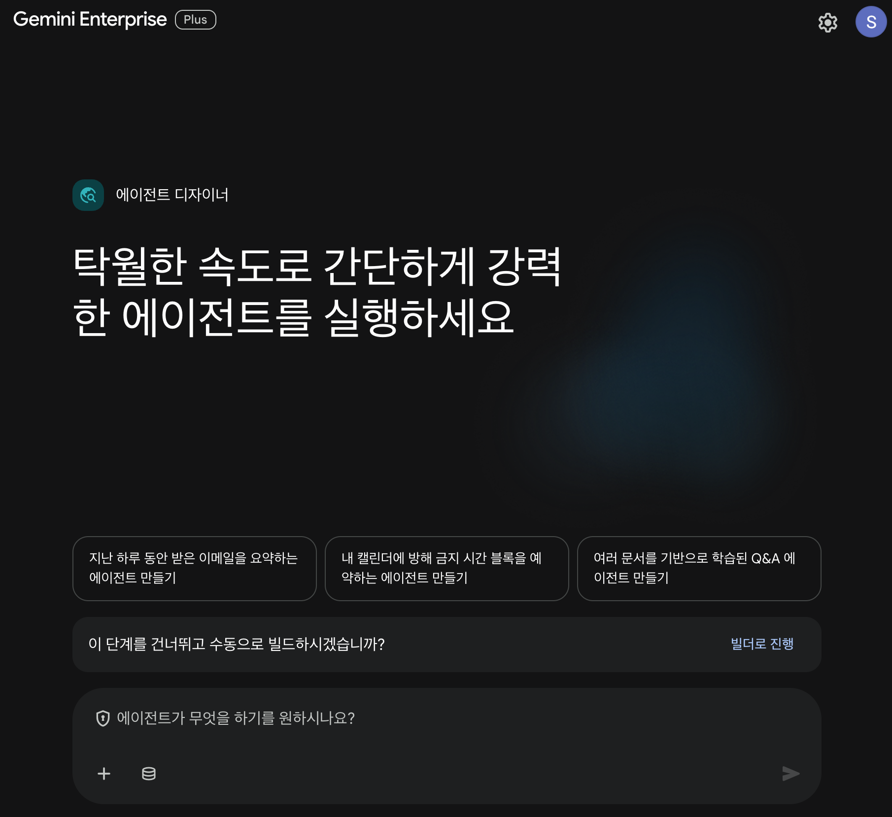
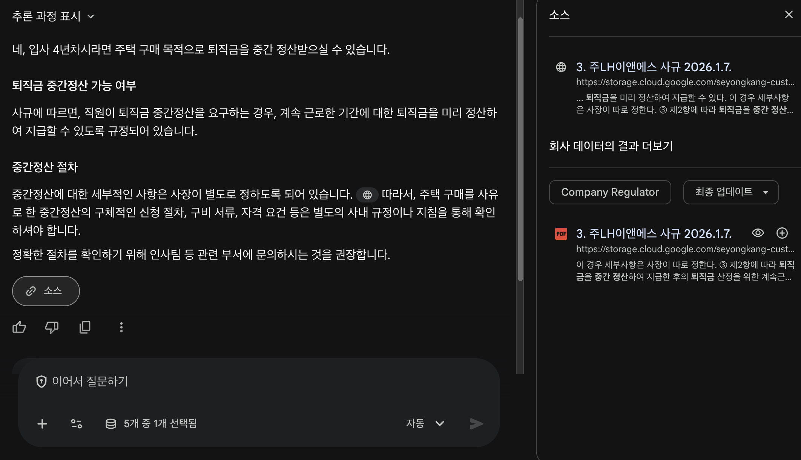

# Gemini Enterprise 핸즈온 가이드

> 화면 옆에 이 페이지를 띄워두고, 코드 블록 우측의 **복사** 버튼으로 프롬프트를 그대로 붙여넣으세요. IT 전문가가 아니어도 괜찮습니다. 차근차근 따라오시면 됩니다.

---

## 오늘 만나볼 'AI 동료', Gemini Enterprise

Gemini Enterprise는 똑똑한 AI 비서를 넘어, **우리 회사의 일하는 방식과 데이터에 맞춰 움직이는 AI 동료**입니다. 일반 AI가 인터넷의 공개 정보로 답한다면, Gemini Enterprise는 회사의 문서·메일·일정까지 함께 찾아 **여러분 업무에 딱 맞는 답**을 줍니다. 마치 수년간 같이 일한 동료처럼요.

**오늘 직접 느껴보실 3가지 순간**

1. **"진짜 조직의 데이터로 답이 나오네"** — 인터넷 검색이 아닌 연동된 데이터스토어에 근거한 답 + 출처(소스)까지.
2. **"코드 한 줄 없이 나만의 AI 비서를 만들었어"** — 대화만으로 5분 만에 생성한 에이전트.
3. **"내가 만든 걸 옆자리 동료가 바로 쓸수있네"** — 개인이 생성한 에이전트를 조직에 그대로 공유.

> 오늘은 연결·인증·세팅 같은 어려운 준비가 **이미 다 끝나 있습니다.** 여러분은 **레고 블록 조립**만 하면 돼요. 90분 동안 그 첫 경험을 압축해서 같이 해봅니다.

| 시간 | 무엇을 할까요 | 끝나면 여러분 손에 |
|---|---|---|
| 14:30–14:40 | 0. 오프닝 & 로그인 & 오늘의 준비물 |
| 14:40–14:55 | 1. 아이스브레이킹 — 인사 나누기 & 내 문제 등록 & 완성형 에이전트 체험 | "AI가 우리 회사 데이터로 답한다"는 첫 감각 + **내 업무 페인포인트 1개** |
| 14:55–15:10 | 2. AI 동료가 회사 데이터에 닿는 원리 + 사내 지식 직접 질의 | 커넥터·도구 감 잡기 & 사규를 직접 검색 |
| 15:10–15:50 | 3. 나만의 에이전트 만들고 굴리기 ★ | 직접 만든 에이전트 + **내 문제에 적용해본 경험** + 팀 공유 |
| 15:50–16:00 | 4. 정리 & 월요일 액션 플랜 | 우리 회사에 가져갈 첫 아이디어 1줄 |

---

## 로그인 

모든 시작은 첫 만남부터! 천천히 따라오세요.

1. **시크릿 창** 열기 — `Ctrl + Shift + N` (Mac은 `Cmd + Shift + N`)
2. 안내받은 **접속 주소(URL)** 를 입력
3. 자리에서 받은 **이메일·비밀번호**로 로그인
4. 메인 채팅창이 보이면 준비 완료 ✅


*▲ 로그인 화면 — 안내받은 이메일·비밀번호를 입력하면 됩니다.*

### 🎁 오늘 여러분 손에 미리 쥐여진 것

| 미리 준비된 것 | 무엇인가요 | 여러분이 할 일 |
|---|---|---|
| 🔌 **Gmail · Drive · Calendar 연결** | 메일·파일·일정을 Gemini가 안전하게 볼 수 있게 연결 완료 | 클릭으로 도구만 추가 |
| 📚 **사내 지식 (데이터 스토어)** | 회사 **사규**를 Gemini가 검색·인용할 수 있게 정리 완료 | 도구 추가 → 질문 |
| 🧩 **기업 공시 도구 (글로벌)** | 미국 SEC 전자공시(EDGAR)에서 글로벌 상장사의 공식 공시·재무를 실시간으로 가져오는 도구 | 도구만 추가 |
| 🤖 **Made by Google 에이전트** | Deep Research·Idea Generation·NotebookLM | 골라서 사용 |

---

## 1. 아이스브레이킹 — 인사부터 나누기

새 동료와 친해지려면 가벼운 대화부터 시작하는 게 좋겠죠? Gemini에게 여러분을 소개해 주세요.

### 1-1. Google 검색 켜기

채팅창 하단의 조절 버튼을 눌러 **Google 검색** 을 **켭니다(ON)**.


*▲ 조절 버튼을 누르고 'Google 검색'을 켜면 실시간 웹 정보를 근거로 답합니다.*

### 1-2. 자기소개

`OOO` 부분만 본인에 맞게 바꿔서 붙여넣기:

```
안녕하세요! 제 이름은 OOO입니다.
저는 OOO 업무를 하고, 최신 AI·DX 트렌드에 관심이 많아요.
기억해주세요.
```

> 💡 "기억해주세요"라고 하면 Gemini가 이 내용을 **저장된 메모리**에 담아 둡니다. 새 채팅을 열어도 "저는 마케터예요"라고 매번 다시 말할 필요가 없어요. 좌측 메뉴 **"저장된 메모리 관리"** 에서 무엇이 저장됐는지 직접 확인하고 지울 수도 있습니다.


### 1-3. 맞춤 정보 요청

나를 파악한 Gemini에게 물어보세요:

```
제가 관심있어 할 만한 최신 기술·산업 뉴스가 있다면
소스와 함께 알려주세요.
```

답변이 실시간으로 생성되는 과정을 볼 수 있고, 답변 하단의 **소스**를 누르면 어떤 자료를 근거로 답했는지 확인됩니다.


*▲ Gemini가 추론 과정을 보여주며 실시간으로 답변을 생성합니다. 하단의 '소스'로 출처를 확인하세요.*

> **잠깐, 왜 '소스(출처)'가 중요할까요?** 일반 AI는 배운 내용만으로 답하다 보니 가끔 틀린 정보를 그럴듯하게 말합니다(이걸 '환각'이라고 해요). Gemini Enterprise는 **회사 데이터나 실시간 검색을 근거로** 답하고, 답변 아래 **"소스" 버튼**으로 무엇을 보고 답했는지 보여줍니다. 그래서 훨씬 믿을 수 있어요. AI 답변은 항상 출처를 확인하는 습관을 들이면 좋습니다.

### 1-4. 내 업무 문제 등록 ★

> **왜 지금 할까요?** 뒤에서 직접 만들 에이전트를 *남이 만든 시나리오*가 아닌 **내 문제**로 완성하기 위해서입니다. 지금 적어두면 3번에서 그대로 꺼내 씁니다.

아래 빈칸을 채워서 Gemini에게 보내세요:

```
제 업무에서 매주 반복되는데 시간이 가장 많이 걸리는 일은 [직접 작성] 입니다.
이걸 AI 동료가 도와준다면 어떤 식으로 가능할지 아이디어를 알려주세요.
```

> 💡 아직 답이 완벽하지 않아도 됩니다. 3번에서 다시 꺼내 실제 에이전트로 만들어볼 거예요. **오늘 워크샵이 끝나면 여러분 손에 '내 문제를 푸는 에이전트 초안' 하나가 남습니다.**

---


### 1-5. 구글이 미리 만든 '완성형' 에이전트 맛보기 

> 좌측 메뉴 **에이전트 → 모든 에이전트 보기**에서 골라 바로 써 봅니다. 버튼 한 번으로 강력해요. 

**① Deep Research** — 여러 자료를 스스로 모아 한 편의 리서치 리포트로 정리해 줍니다.

> 🔌 **먼저 도구 켜기** — 채팅창 하단 **'원통' 아이콘**에서 **Google 검색**을 **켜주세요(ON)**. Deep Research는 웹 자료를 모아 정리하므로 검색 도구가 필요합니다. (1-1에서 이미 켰다면 그대로 두면 됩니다.)

```
우리 산업의 생성형 AI 도입 동향을 조사해서,
최근 사례와 시사점을 리포트로 정리해줘.
```

> 💡 Deep Research는 바로 시작하지 않고 **"이렇게 조사할게요"라는 계획을 먼저 보여줍니다.** 유능한 연구원에게 방향을 잡아주듯, 계획을 검토하고 고쳐달라고 한 뒤 시작하면 결과가 훨씬 좋아집니다. (조사는 시간이 좀 걸릴 수 있어요.)


*▲ Deep Research가 먼저 보여주는 '연구 계획'. 마음에 들면 Start를 누르거나 "시작해줘"라고 하면 됩니다.*

**② Idea Generation** — 주제를 주면 아이디어를 다량으로 만들고 순위까지 매겨줍니다.

```
사내 직원 생산성을 높일 AI 에이전트 아이디어를 제안해줘.
기준: 2주 안에 시범 적용 가능하고, 기존 사내 시스템과 잘 붙을 것.
```

> 💡 아직 프리뷰라 영어로 진행될 수 있고, 탐색에 시간이 걸립니다. 여러 아이디어를 만들고 서로 겨루게 해 가장 좋은 것을 골라줍니다.


*▲ Idea Generation도 '아이디어 탐색 계획'을 먼저 제안합니다. 확인 후 '세션 시작'을 누르면 됩니다.*

**③ NotebookLM** — 내가 넣어준 자료를 **근거로** 요약·핵심 추출, 심지어 **오디오 개요(팟캐스트형)** 까지 만들어 줍니다.

> NotebookLM은 **자료를 먼저 넣어야** 진가가 나옵니다. 아래는 워크샵 가상 회사 **한빛테크놀로지**의 내부 문서 샘플이에요.

**1)** **NotebookLM → 새 노트북 → 소스 추가 → 텍스트 붙여넣기**에 아래를 붙여넣기:

```
한빛테크놀로지 사내 정책 요약 (가상 자료)

[출장] 사전 승인(3일 전, 해외는 본부장). 일비 국내 3만원/해외 80달러.
숙박 국내 10만/해외 18만원(실비). 정산은 복귀 후 7영업일 이내 영수증 제출.
해외 출장 단체보험은 회사 가입, 비자 비용은 회사 부담.
[휴가] 연차 15일(3년마다 +1, 최대 25). 미사용분은 익년 6/30까지, 이후 소멸.
[재택] 주 2회, 부서장 승인. 회사 노트북+VPN 필수. 코어타임 10–16시 응대.
문의: 인사팀 복지파트 최유진 책임, 내선 1234.
```

**2)** 자료가 들어가면 질문해 보세요:

```
출장비 한도와 정산 기한을 알려줘. (답변 하단의 인용 출처 확인)
```

**3)** **오디오 개요(Audio Overview)** 를 만들어 보세요 — 두 진행자가 자료를 대화로 풀어주는 팟캐스트가 생성됩니다. (1~2분 소요)

> **연결 포인트** — 지금은 자료를 **직접** 넣었지만, 뒤에서 만들 에이전트는 같은 사내 문서를 **자동으로 연결**해 매번 붙여넣지 않아도 됩니다.

---

## 2. AI 동료가 회사 데이터에 닿는 원리

방금 써 본 완성형 에이전트는 **구글이 만든 것**이었습니다. 그럼 우리 회사 고유의 데이터(사규·거래처 정보 등)에는 어떻게 닿을까요? 핵심은 딱 두 가지만 기억하면 됩니다.

**한 줄로 정리**

- **에이전트 = 일하는 비서.** 무엇을 할지 스스로 정하고, 필요한 도구를 골라 씁니다.
- **도구(Tool) = 비서의 손발.** 메일을 읽거나, 사규를 찾거나, 회사 정보를 가져오는 일을 합니다.

에이전트에게 어떤 손발(도구)을 쥐여주느냐에 따라 할 수 있는 일이 달라져요. 오늘은 이런 도구들을 씁니다.

| 도구 | 무엇을 하나 | 언제 좋은가 |
|---|---|---|
| 📚 **사내 지식** | 사규·매뉴얼·FAQ를 검색 | **"규칙·절차가 어떻게 돼 있지?"** — 답에 출처가 자동으로 붙어요 |
| 🔌 **Gmail / Drive / Calendar** | 메일 읽고 초안 쓰기 / 파일 읽고 저장 / 일정 보기 | **"내 메일·일정·파일을 봐줘"** |
| 🧩 **기업 공시 도구** | 글로벌 상장사(미국 SEC)의 실시간 공시·재무 가져오기 | **"이 회사 지금 상황이 어때?"** — 어제 올라온 공시까지 |

> 🧰 **잠깐 — 같은 '도구'지만 속은 3종류예요**
> 콘솔에서 모두 똑같이 **'데이터 스토어'** 메뉴로 등록해서 비슷해 보이지만, 안을 들여다보면 서로 다른 기술입니다. *"이게 다 MCP인가?"* 싶을 때 아래만 기억하세요.
>
> | 도구 | 진짜 정체 | 한 줄로 |
> |---|---|---|
> | 📚 **사내 지식** | 검색용 **데이터 스토어**(문서 색인) | 우리 문서를 **색인해 검색·인용** |
> | 🔌 **Gmail · Drive · Calendar** | Google **기본 커넥터** | 구글이 만든 **연결 도구** |
> | 🧩 **기업 공시** | **Custom MCP 서버** | 외부 시스템을 **실시간 호출**하는 우리 전용 도구 |
>
> 👉 셋 중 **진짜 'MCP 서버'는 기업 공시 하나뿐**입니다. 나머지 둘은 데이터 스토어와 기본 커넥터예요. 다만 **등록만 같은 메뉴('데이터 스토어')로** 하고, 에이전트엔 모두 **'도구(커넥터)'로 똑같이** 붙기 때문에 사용법은 동일합니다.
>
> 💬 **MCP가 뭐예요?** *'AI에게 외부 시스템(공시·ERP·CRM 등)을 붙이는 **표준 방식**'* 정도로만 알면 충분합니다. 오늘은 진행자가 미리 만들어 둔 걸 **고르기만** 하면 돼요.


*▲ 채팅창 하단 '원통' 아이콘을 누르면 쓸 수 있는 도구 목록이 보입니다. 필요한 것만 켜서 씁니다.*

> **딱 하나만 기억하세요** — 문서에 **적혀 있는 것**(사규·매뉴얼)은 📚 **사내 지식**으로, 시스템에서 **실시간으로 가져와야 하는 값**(오늘 올라온 공시 등)은 🧩 **기업 공시 같은 전용 도구**로. 에이전트는 필요한 도구만 골라 묶습니다.

> 🔎 **왜 둘을 나눌까?** 예를 들어 *"엔비디아가 오늘 아침 어떤 공시 올렸지?"* 는 어떤 사내 문서에도 안 적혀 있어요. 공시 시스템(SEC)에서 **실시간으로 조회**해야만 알 수 있죠. 반대로 *"출장비 한도는?"* 은 사규 문서에 적혀 있으니 사내 지식이 답합니다. **바로 아래에서 '사내 지식'부터 직접 써 봅니다.**

### 2-1. 사내 지식에 직접 물어보기

에이전트를 만들기 전에, **사내 지식(데이터 스토어)** 이 어떤 건지 채팅창에서 바로 느껴봅니다. 여기엔 우리 회사 **사규**가 검색·인용되도록 준비돼 있어요.

**2-1-1.** 채팅창 하단 **'원통' 아이콘**으로 도구 목록을 열고 **📚 사내 지식**만 **켭니다(ON)**. (다른 도구는 꺼두면 누가 답하는지 더 잘 보여요.)

**2-1-2.** 사규에 관련하여 물어보세요:

```
출장비 한도랑 정산 절차 알려줘. 근거가 된 사규 조항도 함께.
```

**2-1-3.** 답변 하단 **소스**를 눌러, 어떤 사규 문서·조항을 보고 답했는지 확인하세요.

> ✅ **성공 신호** — 답에 **사규 조항이 출처로** 붙으면 OK. 회사 문서에 **근거**를 둔 답이라는 게 일반 검색과 다른 점이에요.
> ⚠️ 엉뚱한 답·"못 찾음"·한글 깨짐 → 진행 보조에게 알려주세요(데이터 스토어 색인 상태 확인).

**추가 질문** — 사규에 있는 주제라면 무엇이든:

```
연차는 며칠이고, 미사용분은 언제까지 쓸 수 있어?
```
```
경조사 휴가·경조금은 어떻게 정해져 있어?
```

> 💡 방금은 도구를 **직접 켜서** 물었죠. 잠시 뒤 **3-2**에서는 이 사내 지식을 **에이전트에 연결**해, 매번 켜지 않아도 정책 질문이면 **항상 사규로 답하는 전용 비서**를 만듭니다.

<!-- 진행자 메모(2-1): '사내 지식' 데이터 스토어에 실제 회사 사규(예: 주LH이앤에스 사규 PDF)를 적재해 두세요.
     ① PDF 텍스트 레이어가 깨진 경우가 많음 → 데이터 스토어 생성 시 'OCR 또는 Layout 파서'로 색인할 것(기본 digital 파서는 한글이 깨져 출처 인용이 실패함).
     ② ~880p 합본 PDF는 고급 파서 페이지 상한에 걸릴 수 있으니 필요 시 규정별로 분할해 업로드.
     ③ 위 예시 질문(출장·연차·경조)이 실제 사규에 실제로 있는지 Preview에서 먼저 확인하고, 없으면 사규에 맞는 주제로 교체. -->

---

## 3. 나만의 에이전트 생성해보기 ★

이제 핵심입니다. 코드 한 줄 없이, 대화만으로 **나만의 AI 비서**를 만들어 봅니다.

### 🧭 에이전트 만들기 — 공통 5단계 (한 번만 익히면 끝)

> 앞으로 만들 에이전트 모두 **이 5단계 반복**입니다. 화면 위치만 한 번 익혀두세요.

1. 좌측 메뉴 → **+ 새 에이전트** 클릭
2. **이름** 입력 → **설정(빨간 창)** 에 역할·절차를 붙여넣기 *(에이전트에게 "너는 이런 일을 해"라고 알려주는 칸)*
3. **도구 추가** → 필요한 도구(사내 지식·Gmail·기업 공시 등) 체크
4. **테스트(파란 창)** 에 프롬프트를 던져 결과 확인 → 잘 나오면 OK
5. 우측 상단 **생성(Create)** → 좌측 목록에 내 에이전트가 뜸


*▲ 에이전트 만들기 화면. 왼쪽 창(에이전트 기능)에 역할을 적고, 오른쪽 창(테스트)에서 바로 굴려봅니다.*

> **막히면?** 결과가 일반 검색처럼 막연하면 → *도구를 안 골랐을 가능성*. "권한 없음" → *메일·일정 연결 동의 화면 확인*. "찾을 수 없음" → *회사명 정확히* (예: "현대건설" ⭕, "현건" ❌) 등을 체크해보세요.

---

### 3-1. 첫 에이전트 — 외부 회사 조회 에이전트

> **WOW 포인트** — 내일 미팅할 외부 회사를 채팅 한 줄로 **실시간 공식 데이터**로 파악합니다. 핵심은, 이게 일반 검색이 아니라 **우리가 직접 만들어 붙인 'Custom MCP 서버'** 가 미국 SEC 전자공시(EDGAR)를 실시간 호출해 가져온 값이라는 것 — 게다가 원본엔 없는 **위험도 점수**까지 계산해줍니다. *"회사가 원하는 시스템은 뭐든 이렇게 도구로 붙일 수 있구나"* 를 처음 체감하는 순간이에요.

> 🧩 **'기업 공시 도구'의 정체 = Custom MCP 서버** — 진행자가 미리 **Cloud Run(구글 클라우드 서버)에 올려 둔 우리 전용 MCP 서버**입니다. 미국 SEC 전자공시(EDGAR) API를 실시간 호출해 회사정보·공시·위험신호·재무를 돌려줘요. 똑같은 방식으로 **국내 DART·사내 ERP·CRM·재고 시스템**도 붙일 수 있습니다 — 이게 "확장 가능한 AI 동료"의 핵심입니다.

**만들기 (60초)**

1. **+ 새 에이전트** → 이름: `외부 회사 조회 에이전트`
2. **설정(빨간 창)** 에 ↓ 그대로 붙여넣기
3. **도구 추가** → `기업 공시 도구`(= Custom MCP 서버) 체크
4. 우측 상단 **생성** → 끝



*▲ '+ 새 에이전트'를 누르면 나오는 화면. 여기서 이름·역할을 적고 도구(Custom MCP)를 붙입니다.*

**설정 (빨간 창):**

```
외부 회사와의 미팅·거래를 앞두고 상대 회사를 빠르게 파악하도록 돕는
조회 에이전트. '기업 공시 도구'(Custom MCP 서버)로 글로벌 상장사의
공식 정보(미국 SEC 전자공시)를 실시간 조회한다.

답하는 순서:
1) 회사 기본정보 — 산업·본사 소재지·상장 거래소·홈페이지
2) 최근 동향 — 최근 공시 (날짜·유형·SEC 링크)
3) 미팅 전 체크 — 위험 신호와 위험도 점수·등급

답변 형식:
- 회사 한 줄 소개 (미팅 때 알아두면 좋은 포인트)
- 최근 공시 TOP 5
- 위험도 점수 + 등급 (🔴/🟠/🟡/🟢)
- 미팅에서 확인할 추천 질문 2~3개

SEC에 없는 회사(비상장·미국 외 비등록 등)는 "공식 공시로는 확인 불가"
라고 알리고, 알 수 있는 범위만 답할 것.
```

**테스트 (파란 창):**

```
다음 주에 '엔비디아'와 협업 미팅이 잡혔어.
미팅 전에 이 회사 빠르게 파악하게 정리해줘.
```

> 💡 엔비디아 대신 **미팅할 법한 글로벌 상장사** 아무거나 — 애플·마이크로소프트·테슬라·아마존 등. **정식 회사명(영문·티커)** 을 써야 결과가 나옵니다(예: `NVDA`). 미국 SEC 미등록 기업(비상장·미국 외)은 조회 불가.

**📋 이렇게 나오면 성공이에요** *(호출 시점에 따라 내용은 달라집니다)*

> ### 엔비디아(NVIDIA) — 미팅 전 브리프
> **한 줄 소개** — 미국 캘리포니아 산타클라라 본사. GPU·AI 가속 컴퓨팅 분야 글로벌 1위(NASDAQ: NVDA). 산업: 반도체.
>
> **최근 공시 TOP 5** *(미국 SEC 전자공시 EDGAR)*
> | 날짜 | 공시 유형 | 링크 |
> |---|---|---|
> | 2026-05-28 | 10-Q (분기보고서) | [SEC](https://www.sec.gov/...) |
> | 2026-05-21 | 8-K (주요 경영사항) | [SEC](https://www.sec.gov/...) |
> | 2026-04-30 | 4 (내부자 거래 신고) | [SEC](https://www.sec.gov/...) |
>
> **위험도 점수 2.0/10 🟡 LOW** — 정기보고·일상적 8-K 중심, 특이 위험 신호 없음.
>
> **미팅에서 확인할 질문**
> - AI 가속기 공급 상황과 우리 협업 일정의 접점은?
> - 최근 8-K(주요 경영사항)가 파트너십 우선순위에 주는 시그널은?

> ✅ **성공 신호** — 실제 공시 날짜·유형이 보이고 **위험도 점수**가 같이 나오면 성공. 이 점수는 SEC 공시 원본에는 없는, **Custom MCP 서버가 공시를 보고 계산해 준 값**이에요. 이게 "그냥 검색"과 결정적으로 다른 점입니다.
> ⚠️ "찾을 수 없다" → 회사명 표기 확인(비상장·외국계는 조회 불가) / 첫 호출이 5~10초 느린 건 정상입니다(잠자던 서버가 깨어나는 시간, '콜드 스타트').

> **느낀 점 한 줄** — *"검색이 아니라, 우리가 만든 MCP 서버가 진짜 오늘 공시로 답했어."* 이게 무료 챗봇과 결정적으로 다른 지점이에요.

#### 🆚 보너스 — 같은 에이전트에 '사내 지식'도 끼워보기 (선택, 3분)

방금 만든 에이전트에 `사내 지식` 도구를 **추가로** 끼워보세요 (도구 추가 → 사내 지식 체크). 이제 **외부(상대 회사)** 와 **내부(우리 사규)** 질문을 번갈아 던져, 같은 에이전트가 어느 도구를 골라 쓰는지 관찰해 보세요.

```
엔비디아 어제 새로 올라온 공시 있어?
```
> → **기업 공시 도구(Custom MCP)** 가 외부 시스템(SEC)에서 실시간으로 가져옵니다.

```
출장비 한도랑 정산 기한 알려줘. 출처도 함께.
```
> → **사내 지식**이 사규에서 찾아 **출처와 함께** 답합니다.

> 🎯 한 줄 정리 — **사내 지식 = "우리 문서에서 찾아 줘"**, **Custom MCP = "외부 시스템 두드려 실시간으로 가져와 줘"**. 같은 에이전트가 질문에 따라 알맞은 손발을 골라 씁니다.

---

### 3-2. 두 번째 에이전트 — 사내 정책 도우미

> **WOW 포인트** — 출장비·휴가·복지를 인사팀에 묻지 않고 **즉답** + 담당자 안내 + (원하면) 메일 초안까지. 반나절 걸리던 문의가 수 초로 줄어듭니다.

> 🔗 **이번엔 '사내 지식'을 에이전트에 붙박이로 연결합니다.** 이 도구는 우리 회사 **사규가 들어간 데이터 스토어**예요(2-1에서 직접 써 본 그것). 2-1에선 매번 켜서 물었지만, 이제 **정책 질문이면 항상 사규를 검색해 출처와 함께 답하는 전용 비서**로 굳히는 겁니다. 즉 이 에이전트의 답은 전부 **연결된 사규 데이터 스토어**에서 나옵니다.

**만들기 — 5단계 그대로**

1. **+ 새 에이전트** → 이름: `사내 정책 도우미`
2. **설정(빨간 창)** 에 아래 붙여넣기
3. **도구 추가** → `사내 지식` · `Gmail`
4. **테스트(파란 창)** 에 프롬프트 던지기
5. **생성**

**설정 (빨간 창):**

```
사내 지식(회사 사규 데이터 스토어)에서 정책·규정을 검색해 즉답하고,
사규에 담당 부서가 적혀 있으면 함께 안내하며, 사용자가 원하면 그
부서에 보낼 Gmail 초안까지 만들어주는 사내 도우미 에이전트.

답하는 순서:
1. 사내 지식에서 관련 규정·조항 찾기 (반드시 출처 포함)
2. 핵심 요약 + 절차 정리 (사규에 적힌 내용만, 추측 금지)
3. 사규에 담당 부서·연락처가 있으면 함께 안내 (없으면 생략)
4. (요청 시) 담당 부서에 보낼 Gmail 초안 만들기
   (실제 발송은 사용자가 검토 후 직접)

답변 형식:
- 한 줄 답변
- 핵심 정책·절차 (3~5줄)
- 인용 출처 (사규 규정명·조항)
- 담당 부서·연락처 (사규에 있는 경우)
```

**테스트 (파란 창):**

```
다음 주 해외 출장 가는데 출장비·비자 처리 알려주고,
담당자에게 보낼 Gmail 초안도 만들어줘.
```

**📋 이렇게 나오면 성공이에요** *(아래 값은 예시 — 실제 사규 내용에 따라 달라집니다)*

> ### ✏️ 한 줄 답변
> 해외 출장은 **출발 전 사전 승인**을 받고, 사규가 정한 **등급별 일비·숙박 한도** 내에서 진행하며 **비자 비용은 회사가 부담**합니다.
>
> ### 📌 핵심 정책·절차
> - 승인: 출발 전 **사전 결재**(해외는 상위 결재)
> - 출장비: **여비규정의 등급별 일비·숙박 한도** 적용(실비)
> - 비자: 본인 신청, **비용은 회사 부담**
> - 정산: 복귀 후 **규정 기한 내** 영수증 제출
>
> ### 📚 인용 출처
> - 『주LH이앤에스 사규 — 여비규정』 제○조 *(실제 조항 번호로 표시됩니다)*
>
> ### 👤 담당 부서 *(사규에 명시된 경우)*
> - 출장·여비 문의: **경영지원/총무 부서** *(사규에 연락처가 있으면 함께 표시)*
>
> ### 📧 Gmail 초안 생성됨 → [메일 초안 열기](https://mail.google.com/.../drafts/...)

<!-- 진행자 메모(3-2): 위 답변 값(승인 절차·한도·조항번호·담당 부서)은 예시입니다.
     데이터 스토어에 실제 사규를 적재한 뒤 Preview에서 동일 질문을 던져 보고, 실제 출력 값으로 교체하면 시연이 더 자연스럽습니다.
     사규에 부서 이메일·내선이 없다면 '담당 부서'까지만 안내되며, 연락처까지 채우려면 임직원 디렉토리 데이터를 별도 연결해야 합니다. -->



*▲ 사내 지식 도구는 사규에서 관련 조항을 찾아 요약하고, 근거가 된 원문 출처까지 함께 보여줍니다.*

> ✅ **성공 신호** — 답변에 *사규 규정명·조항*이 출처로 붙고, "Gmail 초안 생성됨" 링크를 누르면 **이미 본문이 채워진** 메일 화면이 새 탭으로 열리면 OK.
> ⚠️ "출처를 못 찾음·한글이 깨짐" → 먼저 사내 지식 도구가 붙었는지 확인, 그래도면 **데이터 스토어 색인·파서 문제**일 수 있으니 진행 보조에게 알리기 / 초안이 안 만들어짐 → Gmail 권한 동의 화면 확인.

**더 던져볼 질문**

```
연차 미사용분 이월 가능해? 며칠까지?
```
```
재택근무 신청 절차랑 한도 알려줘.
```

> 💡 **Gmail 연결이 아직 없다면?** 도구 추가에서 `Gmail`만 빼고, 설정의 4번 줄을 지우세요. 정책 답변 + 출처 + 담당자 안내까지는 똑같이 동작합니다.

---

### 3-3. 내 문제로 바꿔보기 ★

> **지금이 핵심입니다.** 1-3에서 적어둔 *내 업무의 반복 문제*를 꺼내, 에이전트로 설계해 봅니다. 남이 만든 시나리오를 따라 한 것과 **내 문제로 직접 만든 것**은 다음 주 월요일에 쓸 수 있느냐가 달라집니다.

아래 프롬프트의 `[ ]` 부분을 1-3에서 적었던 내용으로 채워서 붙여넣으세요:

```
아까 제가 적은 '매주 반복되는 일: [여기에 다시 적기]'를 도와줄 에이전트를 만들고 싶어요.
어떤 도구(사내 지식 / Gmail / Drive / Calendar / 기업 공시 중)를 붙이면 될지,
그리고 에이전트 설정 칸에 뭐라고 적으면 될지 같이 설계해줘.
```

Gemini가 도구 조합과 설정 초안을 제안하면, 그대로 **+ 새 에이전트**에 붙여넣어 실제로 만들어 보세요.

> ✅ **성공 기준** — 에이전트 이름에 내 이름·업무가 들어가 있고, 테스트 칸에 내 실제 질문을 던졌을 때 의미 있는 답이 나오면 성공입니다.
> 💡 **시간이 부족하다면** 설계 초안만 저장해도 됩니다. 설정 칸 텍스트를 메모해 두면 월요일에 5분 만에 완성할 수 있어요.

---

### 3-4. (선택·심화) 미팅 사전 브리핑 에이전트 — 도구 여러 개 묶어보기

> 여유가 있다면 도전해 보세요. **여러 도구를 한 에이전트에 묶으면** 어떤 일이 벌어지는지 보여주는 예입니다. *"내일 미팅 있는 회사들, 사전 브리프 좀 만들어줘"* 한 문장으로 **캘린더가 미팅을 찾고 → 3-1의 기업 공시(Custom MCP)로 각 회사를 분석 → Drive에 정리본 저장**까지 한 번에. (3-1에서 단독으로 쓴 Custom MCP를, 이번엔 캘린더·드라이브와 **묶어서** 자동화하는 거예요.)

**만들기 — 5단계 그대로**

1. **+ 새 에이전트** → 이름: `미팅 사전 브리핑`
2. **설정(빨간 창)** 에 아래 붙여넣기
3. **도구 추가** → `Calendar` · `기업 공시 도구` · `Drive`
4. **테스트(파란 창)** 에 프롬프트 던지기
5. **생성**


**설정 (빨간 창):**

```
내일~모레 Google Calendar의 외부 미팅을 찾아, 미팅마다 상대 회사의
사전 브리프를 만들고 Drive에 저장해주는 에이전트.

작업 순서:
1) Calendar에서 지정 기간 외부 미팅 찾기 (내부 회의·개인 일정 제외)
   - 미팅 제목에서 상대 회사명 알아내기
2) 회사마다 기업 공시 도구로 분석 — 기본정보·최근 공시·위험 신호
   - SEC 미등록 회사(비상장·미국 외)는 "공식 공시 미등록 — 별도 확인 필요"라고 표시
3) 회사별 1쪽 브리프 만들기 — 회사 소개 / 최근 동향 / 위험 신호 / 추천 안건 3개
4) Drive 폴더(미팅 브리프 2026)에 회사별로 저장

답변 형식:
- 미팅 일정 한눈에 (표: 시간·회사·장소)
- 회사별 1쪽 브리프
- Drive 저장 결과 (폴더·문서 링크)
```

**테스트 (파란 창):**

```
내일이랑 모레 미팅 사전 브리프 만들고, Drive에 회사별로 저장해줘.
```

> ✅ **성공 신호** — **(a) 캘린더 미팅 인식** + **(b) 기업 공시·위험도** + **(c) Drive 저장 링크**가 한 답변에 나오면 성공.
> ⚠️ 캘린더에 미팅이 안 보임 → 사전 등록 여부 확인 / 외국계 회사 "분석 불가" → 정상(폴백 메시지) / Drive 저장 실패 → Drive 권한 동의 화면.

> **느낀 점 한 줄** — *"캘린더 미팅이 자동으로 인식돼서, 각 회사를 기업 공시 도구로 분석한 정리본이 Drive에 저장됐어."* 도구를 묶으면 이렇게 **하나의 흐름**이 만들어집니다. 회사에 돌아가서 IT팀과 더 키워볼 수 있어요.

---

### 3-5. 👥 내가 만든 에이전트, 팀에 공유하기

> **WOW 포인트** — 한 명이 만든 에이전트를 **팀 전체가 같은 품질로** 바로 사용. 개인 챗봇과 결정적으로 다른 부분이에요.

1. 좌측 에이전트 목록에서 방금 만든 에이전트 클릭 → 우측 상단 **공유(Share)** 아이콘
2. **사용자 또는 그룹** 입력 → 권한 선택 (보기 / 사용 / 편집)
3. **공유 링크 복사** → 옆자리 동료에게 전송 → 동료가 클릭 → **그대로 동작** ✅


*▲ 우측 상단 '공유' 버튼으로 링크를 만들면, 동료가 같은 에이전트를 바로 쓸 수 있습니다.*

> **느낀 점 한 줄** — *"IT 부서 없이도 우리 팀 전용 AI 동료를 배포했다."* 게다가 누가 무엇을 만들었는지, 어떤 도구를 쓰는지 모두 **관리자 콘솔에서 관리**됩니다. (보이지 않는 곳에서 AI가 마구 쓰일 걱정이 없어요.)

---

## 4. 정리 & 월요일 액션 플랜

### 오늘의 핵심 3줄

1. Gemini Enterprise는 회사 데이터·도구에 연결돼 **실제 일을 하는 'AI 동료'** — 검색 답변이 아니라 *실행 결과*를 줍니다.
2. **문서에 적힌 건 사내 지식(출처 자동), 실시간 값은 전용 도구(Custom MCP 서버, 예: SEC 공시·DART)** — 알맞게 골라 쓰면 누가 써도 같은 품질. 필요한 시스템은 MCP로 계속 붙일 수 있어요.
3. 진짜 가치는 "도입했다"가 아니라 **업무에 활용하여 생산성을 높이는 것** — 한 명이 만든 에이전트를 **팀 전체가 같은 품질로** 사용.

### 🗓️ 월요일 아침, 회사로 가져갈 3단계

| 단계 | 누가 | 무엇을 | 결과물 |
|---|---|---|---|
| **① 1 Step** | 본인 | 내 업무 중 **가장 답답한 포인트** + 거기 붙일 도구(Tool) 1개 적기 | 포스트잇 한 장 |
| **② 2 Step** | IT팀과 30분 | 그 도구가 **연결만으로 되는지, 별도 세팅이 필요한지** 확인 | 방향 1줄 |
| **③ 3 Step** | 본인 + IT | 도구 하나 준비 → **코드 없이 에이전트 1개** 만들어 동료 5명에게 공유 | 돌아가는 첫 사내 에이전트 |

> **핵심** — 데이터·연결 같은 Gemini Enterprise 구성은 조직의 AX 전담 부서가, 그 위에 얹는 *업무 흐름*은 현업 담당자가. 이 분업이 가능해진 게 오늘 만난 변화의 본질입니다.

### 오늘 가장 인상 깊었던 순간은?

> √ 표시해 보세요. 회사 보고서·기획서에서 이 표현이 잘 통합니다.

- [ ] 내가 만든 에이전트가 **Custom MCP 서버**로 **SEC의 어제·오늘 공시**를 진짜로 가져왔을 때
- [ ] 답변에 뜬 **위험도 점수**가 *원본엔 없는, MCP 서버가 계산한 값*임을 깨달았을 때
- [ ] 사내 정책을 묻자 **사규 조항을 출처로** 즉답했을 때
- [ ] 인사팀에 보낼 **메일 초안이 이미 채워져서** 열렸을 때
- [ ] 내가 만든 에이전트를 **공유 링크로 옆자리에 30초 만에** 전달했을 때

---

## 부록 — 전체 프롬프트 모음 (복사용)

**아이스브레이킹 · 문제 등록 (1-3)**
```
제 업무에서 매주 반복되는데 시간이 가장 많이 걸리는 일은 [여기에 적기] 입니다.
이걸 AI 동료가 도와준다면 어떤 식으로 가능할지 아이디어를 알려주세요.
```

**내 문제로 바꿔보기 (3-3)**
```
아까 제가 적은 '매주 반복되는 일: [여기에 다시 적기]'를 도와줄 에이전트를 만들고 싶어요.
어떤 도구(사내 지식 / Gmail / Drive / Calendar / 기업 공시 중)를 붙이면 될지,
그리고 에이전트 설정 칸에 뭐라고 적으면 될지 같이 설계해줘.
```

**아이스브레이킹 · 자기소개**
```
안녕하세요! 제 이름은 OOO입니다.
저는 OOO 업무를 하고, 최신 AI·DX 트렌드에 관심이 많아요.
기억해주세요.
```

**아이스브레이킹 · 맞춤 정보**
```
제가 관심있어 할 만한 최신 기술·산업 뉴스가 있다면
소스와 함께 알려주세요.
```

**Made by Google · Deep Research**
```
우리 산업의 생성형 AI 도입 동향을 조사해서,
최근 사례와 시사점을 리포트로 정리해줘.
```

**Made by Google · Idea Generation**
```
사내 직원 생산성을 높일 AI 에이전트 아이디어를 제안해줘.
기준: 2주 안에 시범 적용 가능하고, 기존 사내 시스템과 잘 붙을 것.
```

**Made by Google · NotebookLM** *(samples/ 자료를 소스로 넣은 뒤)*
```
출장비 한도와 정산 기한을 알려줘. (답변 하단의 인용 출처 확인)
```

**에이전트 #1 (외부 회사 조회 에이전트) · 설정**
```
외부 회사와의 미팅·거래를 앞두고 상대 회사를 빠르게 파악하도록 돕는
조회 에이전트. '기업 공시 도구'(Custom MCP 서버)로 글로벌 상장사의
공식 정보(미국 SEC 전자공시)를 실시간 조회한다.

답하는 순서:
1) 회사 기본정보 — 산업·본사 소재지·상장 거래소·홈페이지
2) 최근 동향 — 최근 공시 (날짜·유형·SEC 링크)
3) 미팅 전 체크 — 위험 신호와 위험도 점수·등급

답변 형식:
- 회사 한 줄 소개 (미팅 때 알아두면 좋은 포인트)
- 최근 공시 TOP 5
- 위험도 점수 + 등급 (🔴/🟠/🟡/🟢)
- 미팅에서 확인할 추천 질문 2~3개

SEC에 없는 회사(비상장·미국 외 비등록 등)는 "공식 공시로는 확인 불가"
라고 알리고, 알 수 있는 범위만 답할 것.
```

**에이전트 #1 · 테스트**
```
다음 주에 '엔비디아'와 협업 미팅이 잡혔어.
미팅 전에 이 회사 빠르게 파악하게 정리해줘.
```

**에이전트 #2 (사내 정책 도우미) · 설정**
```
사내 지식(회사 사규 데이터 스토어)에서 정책·규정을 검색해 즉답하고,
사규에 담당 부서가 적혀 있으면 함께 안내하며, 사용자가 원하면 그
부서에 보낼 Gmail 초안까지 만들어주는 사내 도우미 에이전트.

답하는 순서:
1. 사내 지식에서 관련 규정·조항 찾기 (반드시 출처 포함)
2. 핵심 요약 + 절차 정리 (사규에 적힌 내용만, 추측 금지)
3. 사규에 담당 부서·연락처가 있으면 함께 안내 (없으면 생략)
4. (요청 시) 담당 부서에 보낼 Gmail 초안 만들기
   (실제 발송은 사용자가 검토 후 직접)

답변 형식:
- 한 줄 답변
- 핵심 정책·절차 (3~5줄)
- 인용 출처 (사규 규정명·조항)
- 담당 부서·연락처 (사규에 있는 경우)
```

**에이전트 #2 · 테스트**
```
다음 주 해외 출장 가는데 출장비·비자 처리 알려주고,
담당자에게 보낼 Gmail 초안도 만들어줘.
```

**에이전트 #3 (미팅 사전 브리핑 · 선택) · 설정**
```
내일~모레 Google Calendar의 외부 미팅을 찾아, 미팅마다 상대 회사의
사전 브리프를 만들고 Drive에 저장해주는 에이전트.

작업 순서:
1) Calendar에서 지정 기간 외부 미팅 찾기 (내부 회의·개인 일정 제외)
   - 미팅 제목에서 상대 회사명 알아내기
2) 회사마다 기업 공시 도구로 분석 — 기본정보·최근 공시·위험 신호
   - SEC 미등록 회사(비상장·미국 외)는 "공식 공시 미등록 — 별도 확인 필요"라고 표시
3) 회사별 1쪽 브리프 만들기 — 회사 소개 / 최근 동향 / 위험 신호 / 추천 안건 3개
4) Drive 폴더(미팅 브리프 2026)에 회사별로 저장

답변 형식:
- 미팅 일정 한눈에 (표: 시간·회사·장소)
- 회사별 1쪽 브리프
- Drive 저장 결과 (폴더·문서 링크)
```

**에이전트 #3 · 테스트**
```
내일이랑 모레 미팅 사전 브리프 만들고, Drive에 회사별로 저장해줘.
```

---

*막히면 채팅창에서 진행 보조에게 요청하세요. 모든 프롬프트는 그대로 복사해 사용하시면 됩니다.*
