# Gemini Enterprise 핸즈온 가이드

> 화면 옆에 이 페이지를 띄워두고, 코드 블록 우측의 **복사** 버튼으로 프롬프트를 그대로 붙여넣으세요. IT 전문가가 아니어도 괜찮습니다. 차근차근 따라오시면 됩니다.

---

## 오늘 만나볼 'AI 동료', Gemini Enterprise

Gemini Enterprise는 똑똑한 AI 비서를 넘어, **우리 회사의 일하는 방식과 데이터에 맞춰 움직이는 AI 동료**입니다. 일반 AI가 인터넷의 공개 정보로 답한다면, Gemini Enterprise는 회사의 문서·메일·일정까지 함께 찾아 **여러분 업무에 딱 맞는 답**을 줍니다. 마치 수년간 같이 일한 동료처럼요.

### **일반 Gemini와 Gemini Enterprise, 무엇이 다른가요?**

가장 큰 차이점은 **'커넥터'** 와 **'보안'** 입니다. 일반 Gemini가 인터넷상의 공개된 정보를 바탕으로 답변하는 **'지식 전문가'** 라면, Gemini Enterprise는 회사의 내부 시스템과 직접 연결되어 실제 업무를 수행하는 **'액션 전문가'** 에 가깝습니다.

| 구분 | 일반 Gemini | Gemini Enterprise |
|---|---|---|
| 지식의 범위 | 웹, 책 등 공개된 데이터 | 공개 데이터 + 회사 내부 데이터 (문서, 이메일, 캘린더 등) |
| 주요 기능 | 정보 검색, 번역, 글쓰기, 아이디어 구상 | 내부 정보 검색, 문서 요약/작성, 이메일 초안, 회의 일정 조율 |
| 커넥터 | 제한적 | Google Drive, Calendar, Email 등 회사 시스템과 직접 연동 |
| 보안 | 일반 사용자용 보안 | 강화된 기업용 보안 및 데이터 관리 정책 적용 |
| 핵심 가치 | 범용적인 지식 제공 | 업무 생산성 극대화 및 시간 절약 |


### **오늘 직접 느껴보실 3가지 순간**

1. **"진짜 조직의 데이터로 답이 나오네"** — 인터넷 검색이 아닌 연동된 데이터스토어에 근거한 답 + 출처(소스)까지.
2. **"코드 한 줄 없이 나만의 AI 비서를 만들었어"** — 대화만으로 5분 만에 생성한 에이전트.
3. **"내가 만든 걸 옆자리 동료가 바로 쓸수있네"** — 개인이 생성한 에이전트를 조직에 그대로 공유.


### **성공적인 AI 도입을 위한 필수 조건: 사용자의 역할과 노력**

물론, Gemini Enterprise를 도입하는 것만으로 모든 것이 해결되고 AI 경험이 저절로 가속화되는 것은 아닙니다. 최고의 스포츠카가 있어도 운전법을 모르면 무용지물이듯, Gemini Enterprise의 진정한 가치는 사용자인 우리가 AI를 이해하고 적극적으로 활용하려는 노력과 만났을 때 비로소 발현됩니다.

성공적인 AI 기반 업무 혁신을 위해 다음과 같은 노력이 함께 필요합니다.

- AI와 친해지기: AI를 '어려운 기술'이 아닌 '똑똑한 동료'로 생각하고, 간단한 업무부터 꾸준히 사용하며 그 가능성을 체험하고 이해해야 합니다.

- 데이터 정돈하기: AI는 결국 데이터를 기반으로 작동합니다. 내가 가진 파일, 폴더, 기록 등을 AI가 더 잘 이해하고 학습할 수 있도록 명확한 제목과 체계적인 구조로 정리하는 노력이 필요합니다.

- 'AI 활용 노하우' 습득하기: 나의 업무를 더 빠르고 효율적으로 처리하기 위해 AI에게 어떻게 질문하고, 어떤 데이터를 보여주고, 어떤 결과물을 요구할지 등 자신만의 AI 활용 노하우를 적극적으로 고민하고 학습해야 합니다.

Gemini Enterprise는 여러분이 AI 시대를 향해 나아갈 수 있도록 돕는 강력한 엔진입니다. 이 엔진에 '데이터'라는 연료를 공급하고, '활용 노하우'라는 운전 기술을 익혀, 업무의 새로운 고속도로를 달려나갈 준비를 함께 시작해 봅시다.


> 오늘은 연결·인증·세팅 같은 어려운 준비가 **이미 다 끝나 있습니다.** 여러분은 **레고 블록 조립**만 하면 돼요. 90분 동안 그 첫 경험을 압축해서 같이 해봅니다.

| 시간 | 무엇을 할까요 | 끝나면 여러분 손에 |
|---|---|---|
| 14:30–14:40 | 0. 오프닝 & 로그인 & 오늘의 준비물 |
| 14:40–14:50 | 1. 아이스브레이킹 — 인사 나누기 & 내 문제 등록 | 첫 대화 감각 + **내 업무 PainPoint 한가지** |
| 14:50–15:10 | 2. 커넥터로 데이터 연결 — 사내 지식 + 기업 공시 직접 질의 | 커넥터·도구 사용 & 사규·실시간 공시를 직접 검색 |
| 15:10–15:50 | 3. 에이전트 — 완성형 시연 + 나만의 에이전트 만들기 ★ | 직접 만든 에이전트 + **내 문제에 적용해본 경험** + 팀 공유 |
| 15:50–16:00 | 4. 정리 | 우리 회사에 가져갈 아이디어 한 가지 |

---

## 0.로그인 

모든 시작은 첫 만남부터! 천천히 따라오세요.

1. **시크릿 창** 열기 — `Ctrl + Shift + N` (Mac은 `Cmd + Shift + N`)
2. 안내받은 **접속 주소(URL)** 를 입력
3. 자리에서 받은 **이메일·비밀번호**로 로그인
4. 메인 채팅창이 보이면 준비 완료 ✅

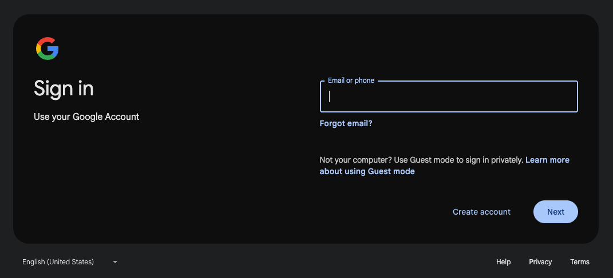

*▲ 로그인 화면 — 안내받은 이메일·비밀번호를 입력하면 됩니다.*

### 🎁 오늘 미리 준비된 커넥터(데이터 스토어)

> **핵심 용어: Gemini Enterprise에서 "데이터 스토어"는 "커넥터" 또는 "데이터 커넥터"와 서로 바꿔 사용할 수 있습니다. ([공식 문서](https://docs.cloud.google.com/gemini/enterprise/docs/connectors/custom-mcp-server/set-up-custom-mcp-server))**

| 미리 준비된 것 | 무엇인가요 |
|---|---|
| 🔌 **Gmail · Drive · Calendar 연결** | 메일·파일·일정을 Gemini가 안전하게 볼 수 있게 연결 완료 | 
| 📚 **사내 지식 (사규)** | 회사 **사규**를 Gemini가 검색·인용할 수 있게 정리 완료 |
| 🧩 **기업 공시 도구 (글로벌)** | 미국 SEC 전자공시(EDGAR)에서 글로벌 상장사의 공식 공시·재무를 실시간으로 가져오는 도구 |

---

## 1. 아이스브레이킹 — 인사부터 나누기

새 동료와 친해지려면 가벼운 대화부터 시작하는게 좋겠죠? Gemini에게 여러분을 소개해 주세요.

### 1-1. Google 검색 켜기

채팅창 하단의 조절 버튼을 눌러 **Google 검색**을 **켭니다(ON)**.

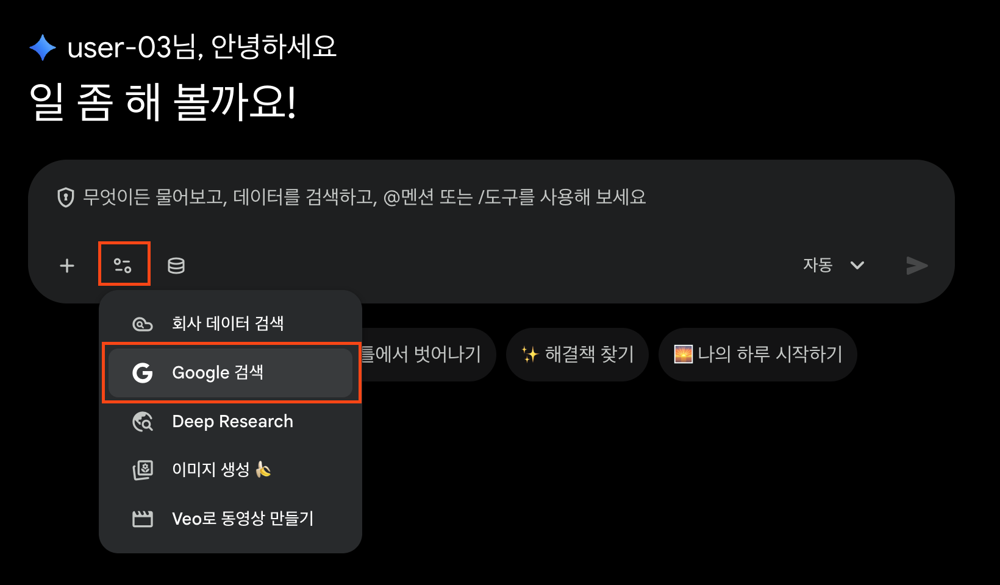

*▲ 도구 버튼을 누르고 'Google 검색'을 켜면 실시간 웹 정보를 근거로 답합니다.*

### 1-2. 자기소개

`OOO` 부분만 본인에 맞게 바꿔서 붙여넣기:

```
안녕하세요! 제 이름은 OOO입니다.
저는 OOO 업무를 하고, 최신 AI·AX 트렌드에 관심이 많아요.
기억해주세요.
```
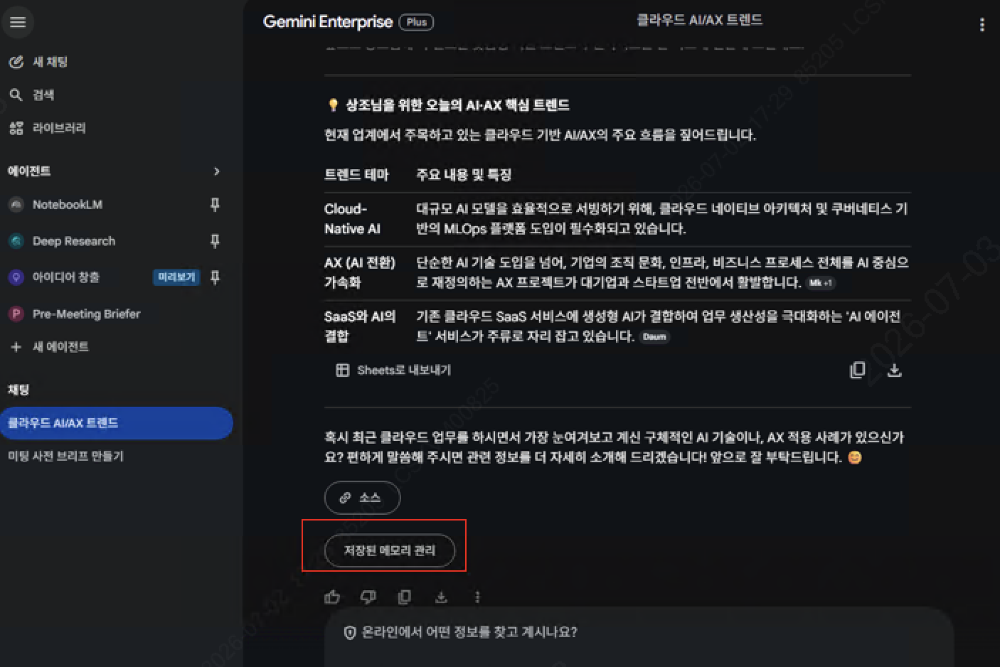

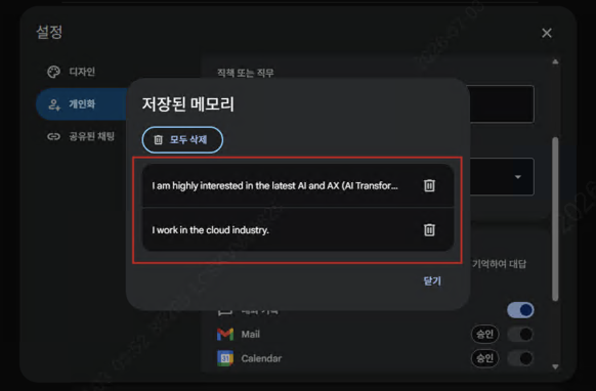

> 💡 "기억해주세요"라고 하면 Gemini가 이 내용을 **저장된 메모리**에 담아 둡니다. 새 채팅을 열어도 "저는 OOO 예요"라고 매번 다시 말할 필요가 없어요. 좌측 메뉴 **"저장된 메모리 관리"** 에서 무엇이 저장됐는지 직접 확인하고 지울 수도 있습니다. 한글로 "기억해주세요" 라고 하면 요청한 정보가 한글로 입력됩니다.


### 1-3. 맞춤 정보 요청

나를 파악한 Gemini에게 물어보세요:

```
제가 관심있어 할 만한 최신 기술·산업 뉴스가 있다면
소스와 함께 알려주세요.
```

답변이 실시간으로 생성되는 과정을 볼 수 있고, 답변 하단의 **소스**를 누르면 어떤 자료를 근거로 답했는지 확인됩니다.

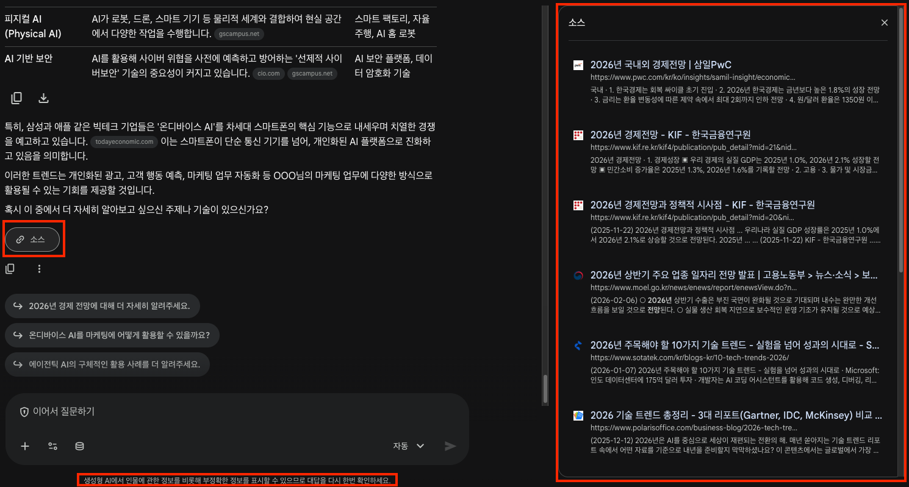

*▲ Gemini가 추론 과정을 보여주며 실시간으로 답변을 생성합니다. 하단의 '소스'로 출처를 확인하세요.*

> **잠깐, 왜 '소스(출처)'가 중요할까요?** 일반 AI는 배운 내용만으로 답하다 보니 가끔 틀린 정보를 그럴듯하게 말합니다(이걸 '환각(hallucination)'이라고 해요). Gemini Enterprise는 **회사 데이터나 실시간 검색을 근거로** 답하고, 답변 아래 **"소스" 버튼**으로 무엇을 보고 답했는지 보여줍니다. 그래서 훨씬 믿을 수 있어요. AI 답변은 항상 출처를 확인하는 습관을 들이면 좋습니다.

### 1-4. 내 업무 문제 등록 ★

> **왜 지금 할까요?** 이후 실습에서 직접 만들 에이전트를 *남이 만든 시나리오*가 아닌 **내 문제**로 완성하기 위해서입니다. 지금 생각해보면 에이전트 생성 실습에서 적용해볼 수 있어요.

아래 빈칸을 채워서 Gemini에게 보내세요: 예) 일정 확인, 자료 작성 등

```
제 업무에서 매주 반복되는데 시간이 가장 많이 걸리는 일은 [**직접 작성해보세요**] 입니다.
이걸 AI 동료가 도와준다면 어떤 식으로 가능할지 아이디어를 알려주세요.
```

> 💡아직 답이 완벽하지 않아도 됩니다. **3. 에이전트 생성하기** 실습에서 실제 에이전트로 다시 만들어볼 거예요. **오늘 워크숍이 끝나면 여러분 손에 '내 문제를 푸는 에이전트 워크플로우 초안' 하나가 남습니다.**

---

## 2. 커넥터로 회사 데이터에 연결하기

**이제 진짜 핵심입니다 — Gemini Enterprise가 우리 회사 고유의 데이터(사규·거래처 정보 등)에 연동되는 방법**

여기서 조직의 **데이터**를 끌어오는 통로가 **커넥터(= 데이터스토어)**이고, 그 위에서 실제 작업을 수행하는 것이 **도구**입니다([공식 문서](https://docs.cloud.google.com/gemini/enterprise/docs/connectors/custom-mcp-server/set-up-custom-mcp-server))

> 🧰 **잠깐 — 세 가지 개념만 숙지해주세요** *(처음엔 가볍게 읽고 넘어가도 됩니다)*
> - **에이전트** = 일하는 비서. 무엇을 할지 정하고 필요한 도구를 골라 씁니다.
> - **커넥터(= 데이터 스토어)** = 자료 창고로 통하는 문. 사규·메일·공시 같은 데이터를 Gemini Enterprise 안으로 끌어옵니다. 콘솔에서 **'데이터 스토어'** 메뉴로 등록하는게 전부 이겁니다.
> - **도구** = 비서의 손발. 커넥터(데이터 스토어)에서 검색하거나, 메일을 쓰거나, 공시를 가져오는 실제 작업이에요.
>
> 👉 한 줄로: **에이전트는 커넥터로 조직의 데이터에 연결하고 도구로 작업한다.**


에이전트에게 어떤 **도구**를 쥐여주느냐에 따라 할 수 있는 일이 달라져요. 그 도구들은 **커넥터**라는 통로를 통해 우리 데이터·시스템에 연결됩니다. 

아래는 **에이전트가 골라 쓰는 도구** 관점의 목록입니다. (콘솔에서는 모두 '커넥터(데이터 스토어)'로 등록돼요 — 자세한 건 아래 박스를 참고하세요.)


| 커넥터 | 종류 | 무엇을 하나 | 언제 좋은가 |
|---|---|---|---|
| 📚 **사내 지식** | 검색용 **데이터 스토어**(문서 색인) | 사규·매뉴얼·FAQ를 검색 | **"규칙·절차가 어떻게 돼 있지?"** — 답에 출처가 자동으로 붙어요 |
| 🔌 **Gmail / Drive / Calendar** | Google **기본 커넥터** | 메일 읽고 초안 쓰기 / 파일 읽고 저장 / 일정 보기 | **"내 메일·일정·파일을 봐줘"** |
| 🧩 **기업 공시 도구** | **Custom MCP 서버** | 글로벌 상장사(미국 SEC)의 실시간 공시·재무 가져오기 | **"이 회사 지금 상황이 어때?"** — 어제 올라온 공시까지 |

>
> 👉 셋 중 **'Custom MCP 서버'는 기업 공시 하나뿐**입니다. 나머지 둘은 문서 색인용 데이터 스토어와 구글 기본 커넥터예요. 종류는 다르지만 **등록은 같은 메뉴('데이터 스토어')로** 하고, Gemini Enterprise UI에서 모두 **커넥터로 똑같이** 붙어서 사용법은 동일합니다.

> 💬 **MCP(Model Context Protocol)가 뭐예요?** *'AI에게 외부 시스템(공시·ERP·CRM 등)을 연동하는 **표준 방식**'* 정도로만 알면 충분합니다. 오늘은 미리 만들어 환경에서 **선택하기만** 하면 돼요.

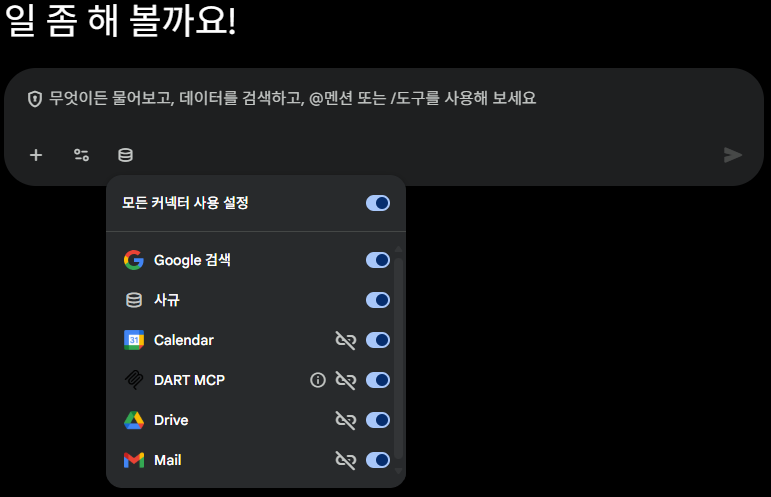

*▲ 채팅창 하단 '원통' 아이콘을 누르면 쓸 수 있는 커넥터 목록이 보입니다. 필요한 것만 켜서 씁니다.*

> **딱 하나만 기억하세요** — 문서에 **적혀 있는 것**(사규·매뉴얼)은 📚 **사내 지식(사규)**으로, 시스템에서 **실시간으로 가져와야 하는 값**(오늘 올라온 공시 등)은 🧩 **기업 공시 같은 전용 도구**로. 커넥터 목록에서 필요한 항목만 선택하세요.

> 🔎 **왜 둘을 나눌까?** 예를 들어 *"엔비디아가 오늘 아침 어떤 공시 올렸지?"* 는 어떤 사내 문서에도 안 적혀 있어요. 공시 시스템(SEC)에서 **실시간으로 조회**해야만 알 수 있죠. 반대로 *"출장비 한도는?"* 은 사규 문서에 적혀 있으니 사내 지식이 답합니다. **바로 아래에서 '사내 지식'부터 직접 사용해 봅시다.**

<details>

<summary><mark style="color:$danger;"><strong>결과가 이상하게 나오고 메일과 캘린더를 찾을 수 없다면 여기를 클릭하세요.</strong></mark></summary>

혹시 답변이 나오지 않았거나, 원하는 답변이 아니라면 다음 내용을 확인해보세요. 커넥터로 연결된 개인정보는 장시간 사용하지 않으면 다시 연결해야합니다. 원통 아이콘을 선택한 다음 캘린더와 메일 옆 메세지가 작업 사용 설정 이라면 먼저 캘린더 옆의 작업 사용 연결 을 클릭합니다.


아래와 같은 새 창이 뜨게되면 사용하는 아이디를 클릭합니다.

<figure><figcaption></figcaption></figure>

스크롤을 내려 가장 아래의 **허용** 버튼을 클릭합니다.

<figure><figcaption></figcaption></figure>

아래 화면처럼 **작업 사용 중지** 로 메세지가 변경되면 완료된 것입니다. 메일도 동일하게 수행해주세요.  :::

<figure><figcaption></figcaption></figure>

</details>


### 2-1. 사내 지식에 직접 물어보기

에이전트를 만들기 전에 **사규** 데이터스토어 가 어떤 건지 체험해봅시다. 여기엔 우리 회사 **사규**가 검색·인용되도록 준비돼 있어요.

**2-1-1.** 새 채팅창 하단 **'원통' 아이콘**으로 도구 목록을 열고 **📚 사규**만 **켭니다(ON)**. (다른 도구는 꺼둡니다(OFF).)

**2-1-2.** 사규에 관련하여 물어보세요:

```
출장비 한도랑 정산 절차 알려줘. 근거가 된 사규 조항도 함께.
```

**2-1-3.** 답변 하단 **소스**를 눌러, 어떤 사규 문서·조항을 보고 답했는지 확인하세요.
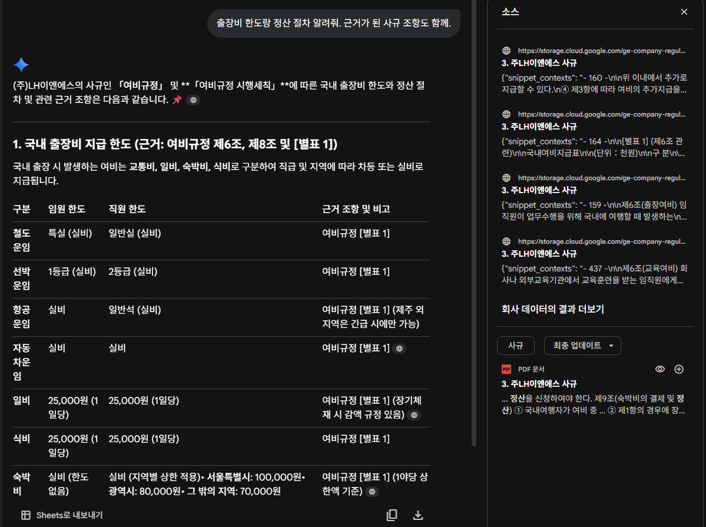

> ✅ **결과** — 답에 **사규 조항이 출처로** 나오면 OK. 회사 문서에 **근거**를 둔 답이라는 게 일반 검색과 다른 점이에요.현재 Gemini Enterprise 검색 UI의 소스 패널은 "문서 단위" 인용까지만 제공하고, 문서 내 특정 페이지·라인으로 점프하는 딥링크는 기본 UI 기능이 아닙니다.

**추가 질문** — 사규에 있는 주제라면 무엇이든:

```
연차는 며칠이고, 미사용분은 언제까지 쓸 수 있어?
```
```
경조사 휴가·경조금은 어떻게 정해져 있어?
```

> 💡 방금은 도구를 **직접 켜서** 물었죠. 잠시 뒤 **3-1**에서는 이 사규를 **에이전트에 연결**해 매번 켜지 않아도 정책 질문이면 **항상 사규로 답하는 전용 비서**를 만듭니다.

---

### 2-2. 기업 공시 도구(Custom MCP 서버)에 직접 물어보기

사내 지식이 '우리 문서'를 찾아준다면, 이번엔 외부 시스템에서 **실시간으로 값을 가져오는** 커넥터를 써봅니다.
새 거래처·공급사·투자처를 검토할 때, "이 회사 요즘 괜찮은가?"를 공식 공시로 즉시 확인해볼 수 있습니다.
채팅창에서 커넥터만 켜면 바로 체험됩니다.

**2-2-1.** 새 채팅창 하단 **'원통' 아이콘**에서 **🧩 기업 공시 도구**만 **켭니다(ON)**. 

**2-2-2.** 글로벌 상장사 이름을 넣어 물어보세요:

```
엔비디아 최근 90일 공시를 날짜, 유형과 함께 알려줘.
```

> 💡 엔비디아 대신 애플·마이크로소프트·테슬라 등 검토하려는 회사 이름을 넣으세요.
> 비상장·미국 외 미등록 기업은 조회되지 않습니다. 첫 호출은 5~10초 느릴 수 있어요.
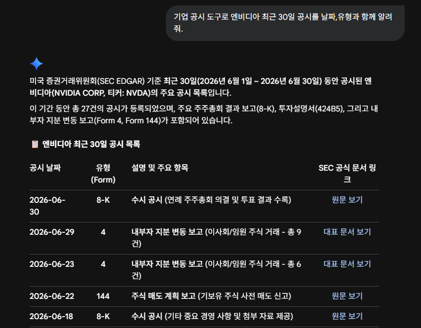

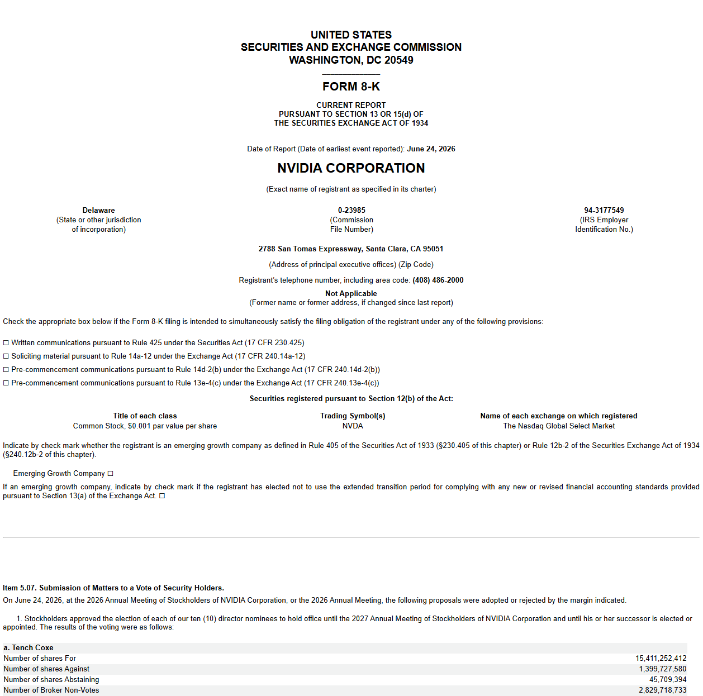

**2-2-3. 위험 신호 자동 점검**
목록만 봐서는 판단이 어렵죠. 이 도구는 공시를 분석해 위험 신호를 자동으로 짚어줍니다.

```
엔비디아에 최근 위험 신호가 있는지 점검해줘.
```

> 소송·경영진 변동·회계 이슈 같은 신호가 있으면 알려주고, 위험도 점수(0~10)로 요약해 줍니다.
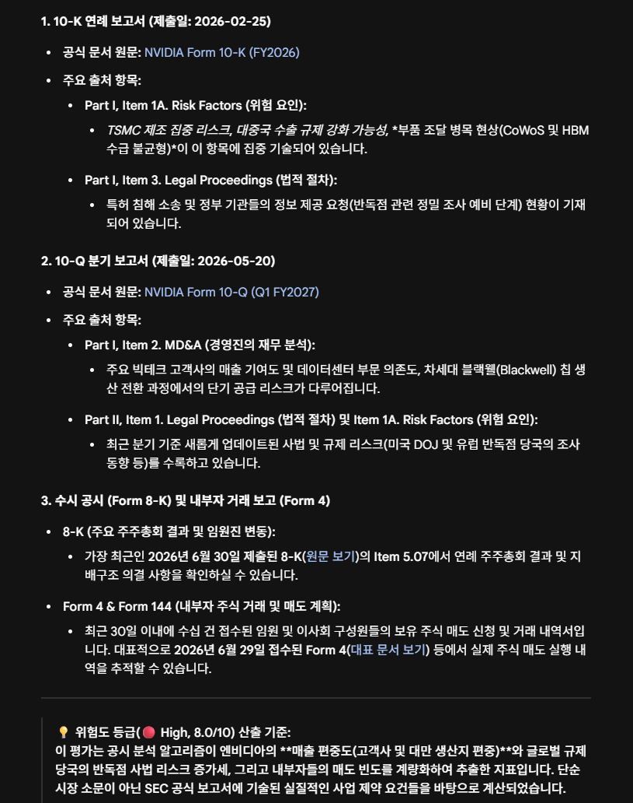

**2-2-4. 재무 건전성 확인**
거래처 판단의 핵심은 "대금 지급 여력/능력" 입니다. 매출·순이익 추세를 봅니다.

```
엔비디아 매출과 순이익 추세를 전년 대비 증감률과 함께 알려줘.
```

> 매출이 꾸준히 늘고 순이익이 안정적이면 긍정 신호, 매출 급감·적자 전환이면 주의 신호예요.
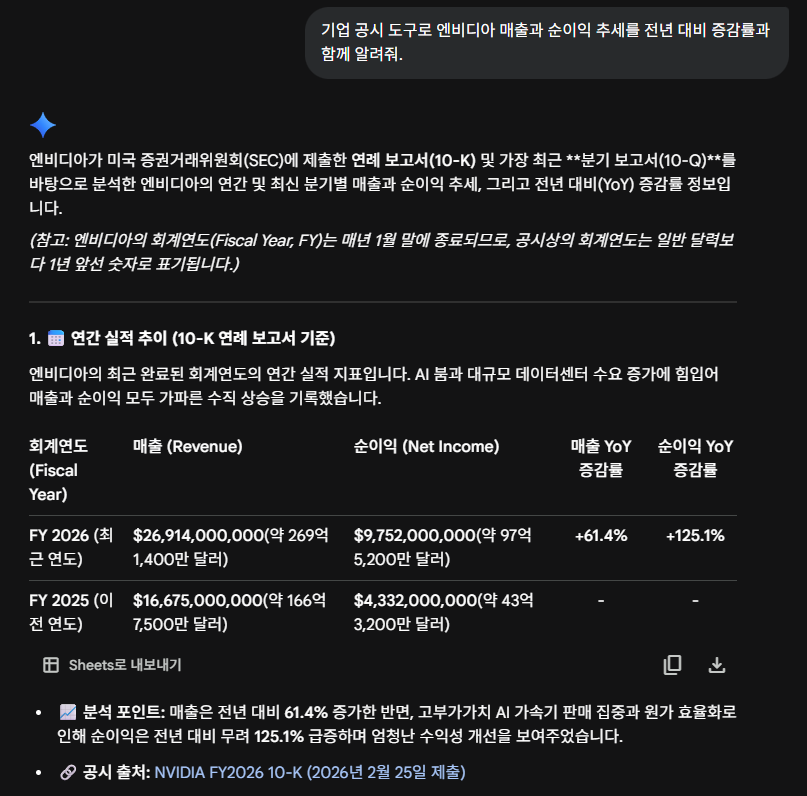


✅ **결과 — 이렇게 판단하세요**
- **최근 공시**에 실적 발표(8-K)·정기보고서(10-K/10-Q)가 정상적으로 올라오고 있는가 → 정상 운영 중
- **위험 신호** 점수가 낮고 특이 이벤트가 없는가 → 리스크 낮음
- **매출·순이익**이 성장 또는 안정 추세인가 → 재무 건전

이 세 가지가 확인되면, 그 회사를 거래처로 검토할 **기초 근거**가 마련된 겁니다.
어떤 사내 문서에도 안 적힌, 공식 공시에서 실시간으로 가져와야만 알 수 있는 값이라는 게 사내 지식과 다른 점이에요.

- ⚠️ "찾을 수 없음" → 회사명 표기 확인(비상장·외국계는 조회 불가).
- ⚠️ 이 결과는 1차 스크리닝용입니다. 실제 거래 결정 전에는 10-K/10-Q 원문의 재무제표와 외부 신용평가를 함께 확인하세요.

> 🎯 **두 커넥터(데이터 스토어)를 다 써 봤어요** 
> — 📚 **사내 지식**(우리 문서에서 찾기)과 🧩 **기업 공시**(외부 시스템에서 실시간으로 가져오기). 
> 3번에서는 이 커넥터(데이터 스토어)들을 **에이전트에 연결**해, 매번 켜지않아도 알아서 골라 쓰는 **나만의 비서**를 만듭니다.

---

## 3. 에이전트 생성해보기 ★

이제 핵심입니다. 코드 한 줄 없이, 대화만으로 **나만의 AI 비서**를 만들어 봅니다.

### 구글이 미리 만든 '완성형' 에이전트 *(진행자 시연)*

> 본격적으로 만들기 전에, **이미 완성된 에이전트가 얼마나 강력한지** 진행자가 화면으로 보여드립니다. 직접 따라 할 필요 없이 **결과만 눈으로 보시면 돼요.** (구글이 미리 만든 '완성형' 에이전트는 시간이 걸려서, 미리 돌려둔 결과로 보여드립니다.) 

**① Deep Research** — 여러 자료를 스스로 모아 한 편의 리서치 리포트로 정리해 줍니다.

```
우리 산업의 생성형 AI 도입 동향을 조사해서
최근 사례와 시사점을 리포트로 정리해줘.
```

> 💡 Deep Research는 바로 시작하지 않고 **"이렇게 조사할게요"라는 계획을 먼저 보여줍니다.** 유능한 연구원에게 방향을 잡아주듯 계획을 검토하고 고쳐달라고 한 뒤 시작하면 결과가 훨씬 좋아집니다. 아래 화면이 그 '연구 계획'이에요.

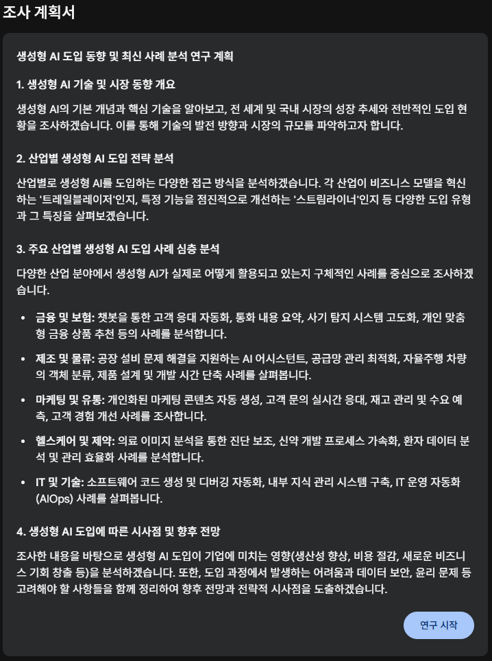

*▲ Deep Research가 먼저 보여주는 '연구 계획'. 마음에 들면 Start를 누르거나 "시작해줘"라고 하면 조사가 시작됩니다.*

**② Idea Generation** — 주제를 주면 아이디어를 다량으로 만들고 **서로 겨루게해 순위까지** 매겨줍니다.

```
사내 직원 생산성을 높일 AI 에이전트 아이디어를 제안해줘.
기준: 2주 안에 시범 적용 가능하고, 기존 사내 시스템과 잘 연동할 수 있을 것.
```

> 💡 무작위 나열이 아니라 '어떻게 발상할지' 계획(Idea Map)을 먼저 세우고, 여러 아이디어를 경쟁시켜 가장 좋은 걸 골라줍니다. (아직 프리뷰라 영어로 진행될 수 있어요.)

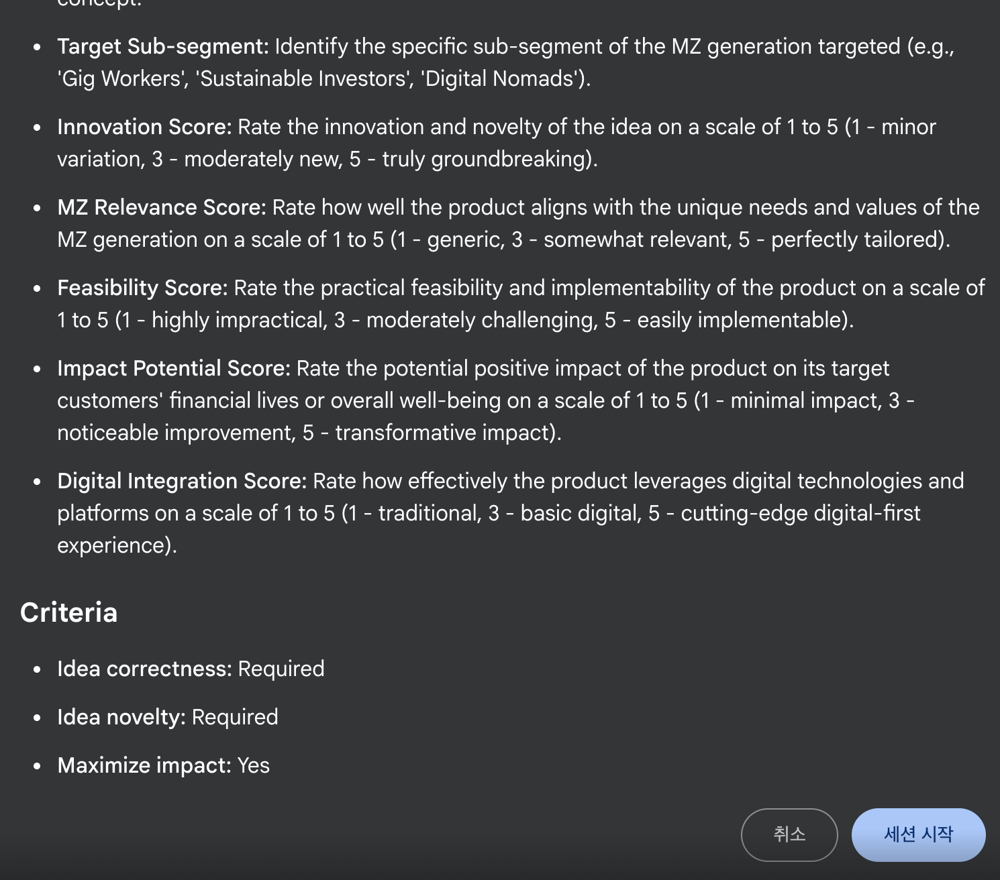

*▲ Idea Generation도 '아이디어 탐색 계획'을 먼저 제안합니다. 확인 후 '세션 시작'을 누르면 탐색이 시작됩니다.*

**③ NotebookLM** — 넣어준 자료를 **근거로** 요약·핵심 추출, 심지어 **오디오 개요(팟캐스트형)** 까지 만들어 줍니다.

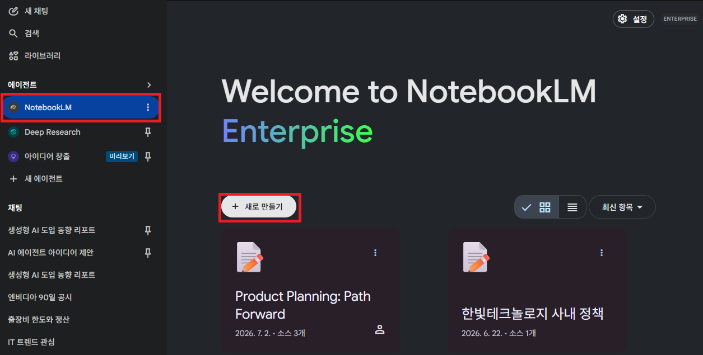


> 진행자가 **가상 회의록 3건**(Word 파일)을 자료로 업로드합니다. 회의가 많아 "무슨 결정이 났고, 내가 뭘 해야 하는지"가 여러 회의록에 흩어지기 쉬운데, NotebookLM은 **사용자가 업로드한 회의록 자료만 근거로** 답하고 **어느 회의록이 근거인지 출처(인용)**까지 짚어줍니다. 

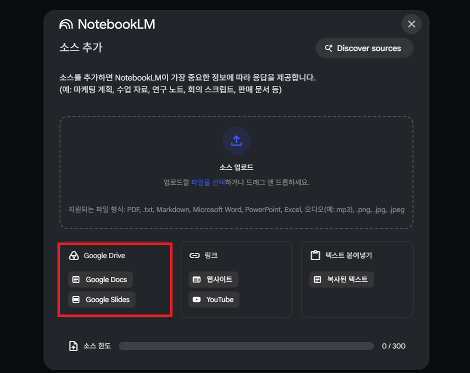

**넣을 자료 (진행자가 미리 준비 — 파일 3개를 각각 소스로 업로드):**
- `회의록_A_제품기획_20260622.docx` — 6/22 제품기획 주간회의 (대시보드 시안 리뷰, 알림 기능 이월 결정 등)
- `회의록_B_마케팅제품정렬_20260624.docx` — 6/24 마케팅·제품 정렬 미팅 (캠페인 메시지 확정, 출시일·마케팅 소재 기한 등)
- `회의록_C_제품기획_20260629.docx` — 6/29 제품기획 주간회의 (API 핫픽스 결정, 출시일·QA 일정 확정 등)

> 🔗 **미리 만들어 둔 노트북으로 바로 보기.** NotebookLM은 자료 분석에 시간이 걸려서, 위 회의록 3건을 미리 넣어 분석해 둔 노트북을 준비했습니다. 아래 링크로 결과(요약·출처 인용·오디오 개요)를 바로 확인하세요.
>
> 👉 [**미리 준비된 NotebookLM 노트북 열기**](https://vertexaisearch.cloud.google.com/global/home/cid/92367ba5-ba71-46b3-bd6e-0ad2537c886a/r/notebook/41ed07b9-b18e-49c0-a367-dc85e20cf395)

> 세 건의 회의록을 넣고 위처럼 물으면, **결정사항과 미완료 액션아이템을 담당자·기한과 함께** 정리하고 **어느 회의록이 근거인지 출처(인용)**까지 보여줍니다. 그다음 버튼 하나로 **두 진행자가 이 내용을 대화로 풀어주는 팟캐스트(오디오 개요)** 까지 생성되는 걸 보여드릴게요.

그다음 질문 → **오디오 개요(Audio Overview)** 생성:

```
위 회의록들 기준으로, 지금까지 '결정된 사항'과 '아직 안 끝난 할 일'을
담당자·기한과 함께 정리해줘. (답변 하단의 인용 출처 확인)
```

> **연결 포인트** — 방금 본 건 **구글이 미리 완성해 둔** 에이전트예요. 지금부터는 **여러분이 직접** 코드 한 줄 없이 나만의 에이전트를 만들어 봅니다. 


---

### 🧭 에이전트 만들기 — 공통 5단계 (한 번만 익히면 끝)

> 앞으로 만들 에이전트 모두 **아래 단계 반복**입니다. 화면 위치만 한 번 익혀두세요.

1. 좌측 메뉴 → **+ 새 에이전트** → 하단의 **빌더로 진행** 클릭
2. **이름** 입력 → **설정(빨간 창)** 에 역할·절차를 붙여넣기 *(에이전트에게 "너는 이런 일을 해"라고 알려주는 칸)*
3. **테스트(파란 창)** 에 프롬프트를 던져 결과 확인 → 잘 나오면 OK
4. 우측 상단 **생성(Create)** → 좌측 목록에 내 에이전트가 뜸

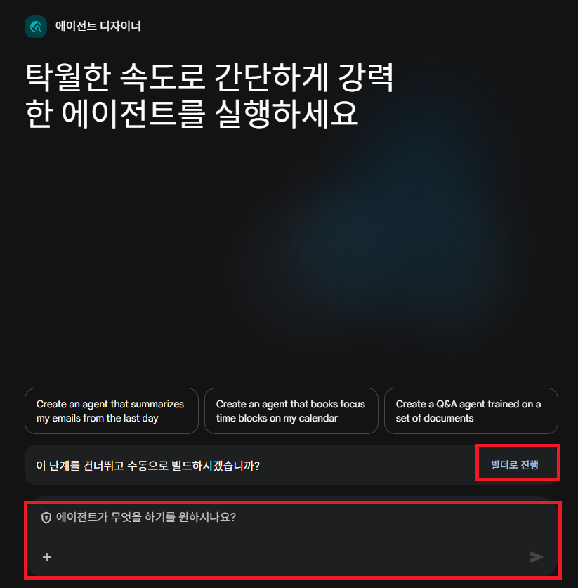


*▲ 에이전트 만들기 화면. 왼쪽 창(에이전트 기능)에 역할을 적고, 오른쪽 창(테스트)에서 바로 테스트해봅니다.*

> **막히면?** 결과가 일반 검색처럼 막연하면 → *도구를 안 골랐을 가능성*. "권한 없음" → *메일·일정 연결 동의 화면 확인*. "찾을 수 없음" → *회사명 정확히* (예: "현대건설" ⭕, "현건" ❌) 등을 체크해보세요.

---

### 3-1. 첫 번째 에이전트 — 사내 정책 도우미

> 🔗 **'사규'를 에이전트에 연결합니다.** 이 커넥터는 우리 회사 **사규가 들어간 데이터 스토어**예요. 이제 **정책 질문이면 항상 사규를 검색해 출처와 함께 답하는 전용 비서**인 겁니다. 즉 이 에이전트의 답은 전부 **연결된 사규 데이터 스토어**에서 나옵니다.


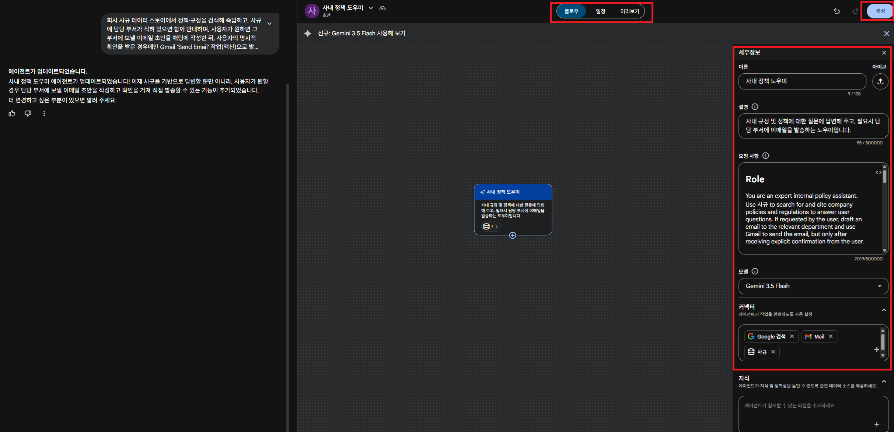

**에이전트 만들기**

1. **+ 새 에이전트** → 이름: `사내 정책 도우미`
2. **설정(빨간 창)** 에 아래 붙여넣기
3. **테스트(파란 창)** 에 프롬프트 입력하기
4. **생성**

**설정 (빨간 창):**

```
회사 사규 데이터 스토어에서 정책·규정을 검색해 즉답하고, 사규에 담당 부서가 적혀 있으면 함께 안내하며, 사용자가 원하면 그 부서에 보낼 이메일 초안을 채팅에 작성한 뒤, 사용자의 명시적 확인을 받은 경우에만 Gmail 'Send Email' 작업(액션)으로 발송하는 사내 도우미 에이전트.

【사용하는 커넥터】
- 사내 지식(사규 데이터 스토어): 정책·규정 검색 및 인용
- Gmail 커넥터의 'Send Email' 액션: 담당 부서로 메일 발송 (반드시 사용자 확인 후에만)

【답하는 순서】
1. 사내 지식에서 관련 규정·조항 찾기 (반드시 출처 포함)
2. 핵심 요약 + 절차 정리 (사규에 적힌 내용만, 추측 금지)
3. 사규에 담당 부서·연락처가 있으면 함께 안내 (없으면 생략)
4. (사용자가 요청할 때만) 담당 부서에 보낼 이메일 초안을 채팅에 먼저 보여준다.
   - 초안에는 받는 사람, 제목, 본문을 모두 포함한다.
   - 초안을 보여준 뒤 "이대로 발송할까요?"라고 반드시 확인을 구한다.
   - 사용자가 "보내줘/발송" 등으로 명시적으로 동의한 경우에만 'Send Email' 액션으로 발송한다.
   - 사용자 확인 없이 절대 먼저 발송하지 않는다.
   - 받는 사람 주소가 사규에 없으면 임의로 지어내지 말고 사용자에게 물어본다.

【이메일 초안 형식】
- 받는 사람: (사규에 명시된 담당 부서 주소 / 없으면 사용자에게 확인)
- 제목: [문의] {규정 주제} 관련 문의
- 본문:
  · 인사 → 문의 배경(어떤 규정에 대해) → 구체적 질문 → 맺음말
  · 정중한 사내 이메일 톤, 5~8줄 이내

【답변 형식】
- 한 줄 답변
- 핵심 정책·절차 (3~5줄)
- 인용 출처 (사규 규정명·조항)
- 담당 부서·연락처 (사규에 있는 경우)

【지켜야 할 원칙】
- 사규에 없는 내용은 추측하지 않는다. 모르면 "사규에서 확인되지 않습니다"라고 답한다.
- 모든 규정 답변에는 반드시 출처(규정명·조항)를 붙인다.
- 이메일은 사용자 확인 없이 발송하지 않는다.
```

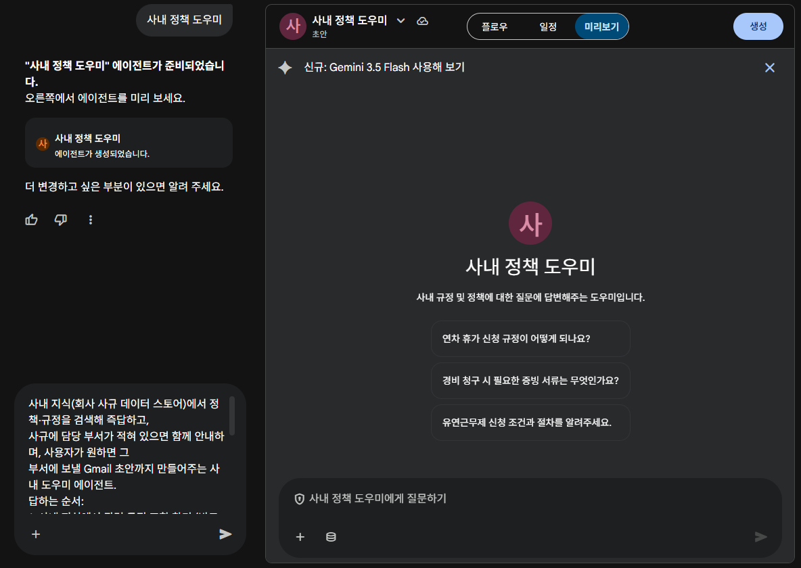

**테스트 (파란 창):**

```
다음 주 해외 출장 가는데 출장비·비자 처리 절차 알려주고
담당 부서에 보낼 문의 메일을 Gmail 초안함에 저장해줘.
```

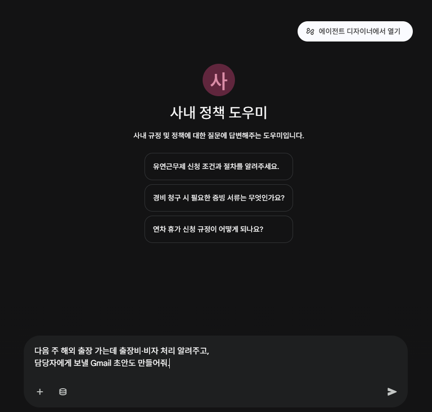


**📋 이렇게 나오면 성공이에요** *(아래 값은 예시 — 실제 사규 내용에 따라 달라집니다)*

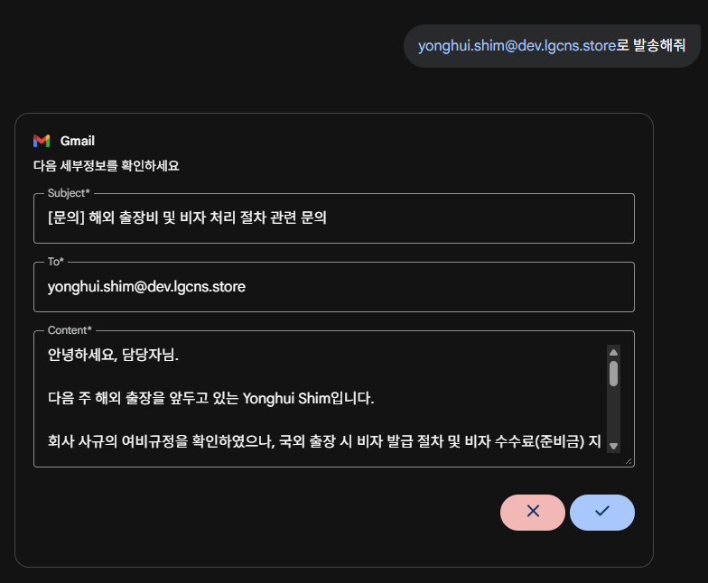

*▲ 사내 지식 도구는 사규에서 관련 조항을 찾아 요약하고, 근거가 된 원문 출처까지 함께 보여줍니다.*

> ✅ **결과** - 전송한 메일 주소에서 Gemini Enterprise에서 발송한 메일을 확인할 수 있습니다.
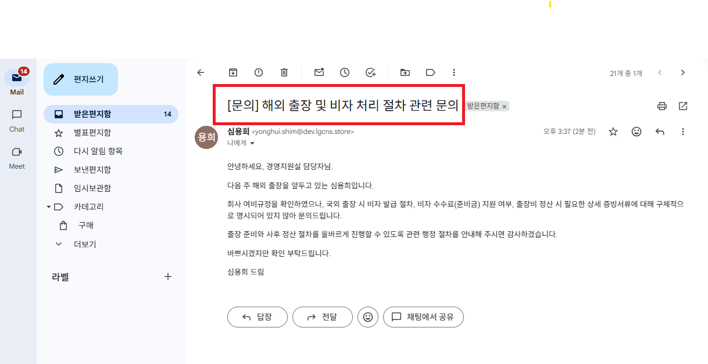

---
### 3-2. 두 번째 에이전트 — 주간 업계 동향 브리핑 (스케줄 작업)

> ⏰ **이번엔 '스케줄 작업'을 걸어봅니다.** 앞의 정책 도우미가 "물어보면 답하는" 비서였다면, 이 에이전트는 **매주 알아서 우리 업계·경쟁사 뉴스를 조사해 요약 리포트를 나에게 보내주는** 비서예요.
>
> 🌐 **소스가 다릅니다.** 정책 도우미는 '사규 데이터 스토어'를 봤지만, 이 에이전트는 **웹 검색(그라운딩)**으로 매주 새로 나오는 뉴스를 가져옵니다. 사규는 잘 안 바뀌지만 시장 뉴스는 매주 업데이트되니 스케줄 자동 실행의 가치가 확실히 드러나요.
>
> ⚠️ **왜 '나에게' 보낼까요?** 스케줄 작업은 사람이 중간에 확인하지 못하는 **자동 실행**입니다. 그래서 리포트는 **에이전트 사용자 본인 앞으로만** 보냅니다. 이렇게 하면 다른 사람이 관여하는 작업(승인 대기)과 달리 자동으로 실행됩니다.

**에이전트 만들기**

1. **+ 새 에이전트** → 이름: `주간 업계 동향 브리핑`
2. **설정(빨간 창)** 에 아래 붙여넣기
3. **테스트(파란 창)** 에 프롬프트 입력하기
4. **생성**

**설정 (빨간 창):**
```
웹 검색으로 우리 업계·경쟁사의 최근 1주일 주요 동향을 조사해 요약하고, '에이전트 사용자 본인'에게 이메일 리포트로 보내주는 주간 업계 동향 브리핑 에이전트.【관심 분야 — 실제 회사에 맞게 수정】

산업: (예: 모빌리티 / 클라우드·AI / 제조 등)
주시 대상: (예: 주요 경쟁사명, 관심 기술·제품, 규제 이슈)

※ 워크숍에서는 위 항목을 자기 회사·업계에 맞게 바꿔 넣으세요.
【사용하는 커넥터】

웹 검색(그라운딩): 최근 1주일 뉴스·발표·동향 조사
Gmail 커넥터의 'Send Email' 액션: 리포트를 '사용자 본인'에게만 발송
【중요 원칙 — 발송 대상】

이 에이전트는 담당 부서·외부·동료로 절대 메일을 보내지 않는다.
수신자는 항상 '에이전트를 실행하는 사용자 본인'이다.
【리포트 작성 순서】

웹 검색으로 지난 7일 이내의 업계·경쟁사 주요 뉴스를 찾는다. (반드시 출처 링크 포함)
오래된 뉴스·중복은 제외하고, 우리와 관련성 높은 항목 위주로 3~5건을 고른다.
아래 형식으로 요약 리포트를 만든다. (확인되지 않은 내용은 단정하지 않는다)
'Send Email' 액션으로 사용자 본인에게 발송한다.
【이메일 형식】

받는 사람: 에이전트 사용자 본인
제목: [주간 업계 동향] {이번 주 날짜}
본문:

· 인사 한 줄

· 이번 주 핵심 3~5건 — 각 항목마다: 한 줄 요약 + 왜 중요한지 한 줄 + 출처 링크

· 한 줄 총평 (이번 주 흐름 요약)

· 맺음말 한 줄
정중한 사내 이메일 톤, 항목별로 구분되게
【지켜야 할 원칙】

최근 1주일 내 정보 위주로 다룬다. 오래된 뉴스는 넣지 않는다.
모든 항목에 출처 링크를 붙인다. 확인 안 된 내용은 "확인되지 않음"으로 표기한다.
수신자는 반드시 사용자 본인이며, 외부·동료로는 발송하지 않는다.
```
---


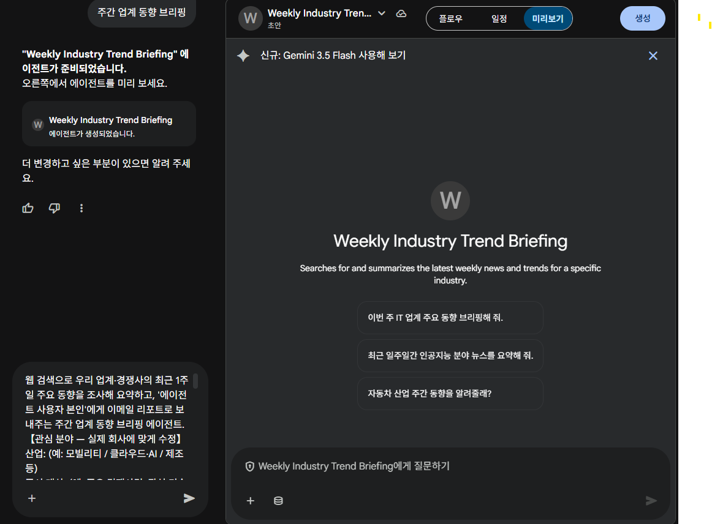

**스케줄 설정 — 상단 '일정' 탭**

리포트가 정상적으로 나오는 걸 확인했다면, 상단의 **일정** 탭에서 자동 실행 주기를 겁니다.

1. **반복 빈도: 매주**
2. **실행 요일: 월**
3. **시작 시간: 00:00**
4. **시간대: (GMT+09:00) Korean Standard Time - Seoul**
5. **트리거 프롬프트** : 아래 내용 입력

**트리거 프롬프트:**
```
우리 업계·경쟁사의 지난 7일 주요 동향을 웹 검색으로 조사해 관련성 높은 3~5건을 요약하고, 각 항목에 출처 링크를 붙여 내 메일로 [주간 업계 동향] 리포트를 보내줘.
```
6. **일정 추가**

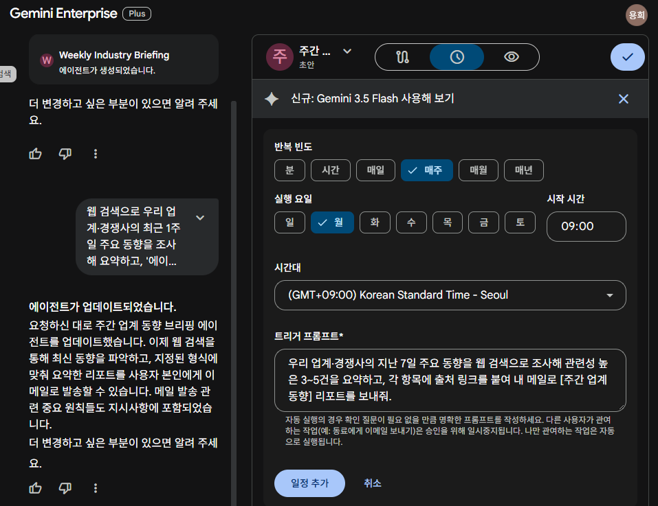

> 💡 **체크포인트.** 스케줄이 걸리면 사용자가 아무것도 하지 않아도 에이전트가 알아서 ① 웹 검색으로 업계 동향 조사 → ② 관련성 높은 3~5건 요약 → ③ 본인 앞 발송을 수행합니다.

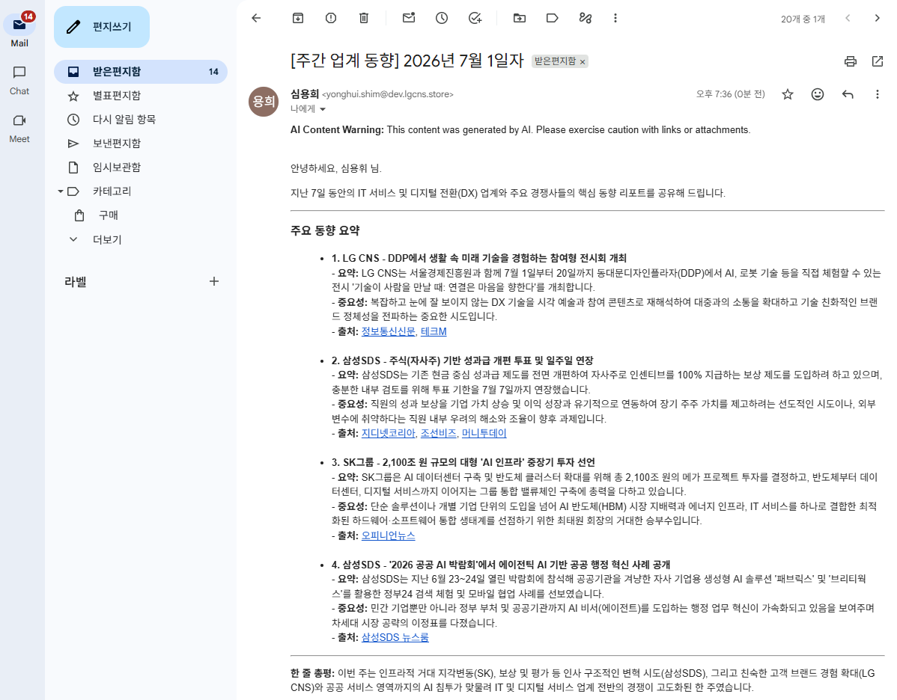


### 3-3. 미팅 사전 브리핑 에이전트 — 여러 커넥터 활용해보기

> **여러 커넥터를 한 에이전트에 묶으면** 어떤 상황이 벌어지는지 보여주는 예입니다. *"이번달 미팅 있는 회사들, 사전 브리프 좀 만들어줘"* 한 문장으로 **캘린더가 미팅을 찾고 → 기업 공시(Custom MCP 서버)도구와 Google Search로 각 회사를 분석 → Drive에 정리본 저장**까지 한 번에. (3-1에서 단독으로 쓴 Custom MCP를, 이번엔 캘린더·드라이브와 **묶어서** 자동화하는 거예요.)

**에이전트 만들기**

1. **+ 새 에이전트** → 이름: `미팅 사전 브리핑`
2. **설정(빨간 창)** 에 아래 붙여넣기
3. **테스트(파란 창)** 에 프롬프트 입력하기
4. **생성**


**설정 (빨간 창):**

```
Google Calendar의 외부 미팅을 찾아, 미팅마다 상대 회사의
사전 브리프를 만들고 Drive에 저장해주는 에이전트.

작업 순서:
1) Calendar에서 지정 기간 외부 미팅 찾기 (내부 회의·개인 일정 제외)
   - 미팅 제목에서 상대 회사명 알아내기
2) 회사마다 기업 공시 도구로 분석 — 기본정보·최근 공시·위험 신호
   - SEC 미등록 회사(비상장·미국 외)는 "공식 공시 미등록 — 별도 확인 필요"라고 표시
3) 회사별 1쪽 브리프 만들기 — 회사 소개 / 최근 동향 / 위험 신호 / 추천 안건 3개
4) Drive 폴더(미팅 브리프 2026)에 회사별로 저장
   - 브리프는 마크다운(.md) 파일로 저장한다.
   - 파일명은 한글을 쓰지 않고 영문·숫자·언더스코어만 사용한다.
     (형식: {회사영문명}_briefing.md  예: Salesforce_briefing.md, ServiceNow_briefing.md)
   - 회사명이 한글뿐이면 영문 표기나 티커로 바꿔 파일명을 만든다. (예: 노바테크 → NovaTech_briefing.md)
   - 문서 제목·본문의 한글은 그대로 두어도 된다. (파일명만 영문으로)

답변 형식:
- 미팅 일정 한눈에 (표: 시간·회사·장소)
- 회사별 1쪽 브리프
- Drive 저장 결과 (폴더·문서 링크)
```

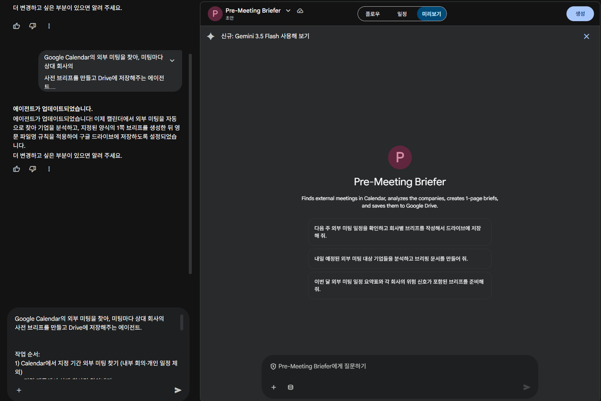


**테스트 (파란 창):**

```
다음주 예정된 미팅 사전 브리프 만들고, Drive에 회사별로 저장해줘.
```
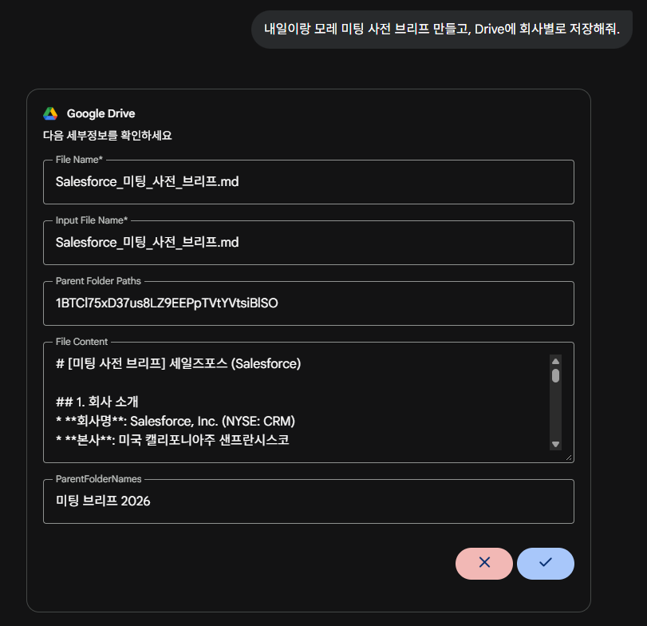

> 📄 **Word로 받고 싶다면 — 저장은 .md, 변환은 두 번 클릭.** 이 에이전트는 브리프를 마크다운(`.md`) 파일로 Drive에 저장합니다. Word(.docx)가 필요하면:
> 1. Drive에서 저장된 `.md` 파일을 우클릭 → **연결 앱 → Google Docs로 열기**
> 2. Google Docs에서 **파일 → 다운로드 → Microsoft Word(.docx)**
>
> 제목·굵기 같은 서식이 그대로 살아 변환됩니다. *(Gemini Enterprise의 Drive 커넥터는 표준 액션상 '파일 업로드'만 지원해, 에이전트가 직접 .docx나 Google Docs 문서를 만들지는 않습니다. 문서 생성이 꼭 필요하면 회사에 돌아가 IT팀과 커스텀 액션으로 확장할 수 있어요.)*

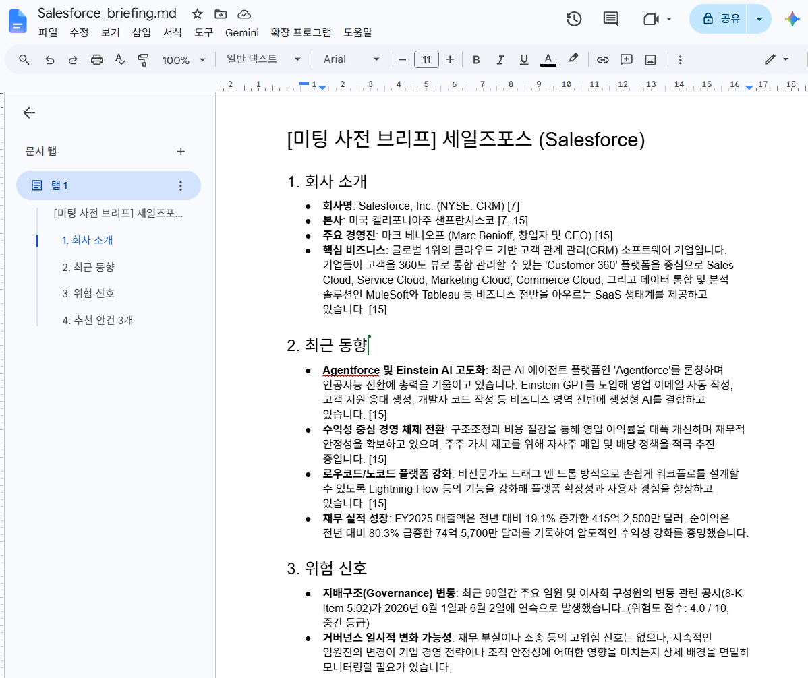

> **결과** — *"사용자 Gmail 계정의 캘린더 일정에 등록된 회사들과의 미팅이 자동으로 인식돼서 각 회사를 기업 공시 도구로 분석한 정리본이 Drive에 저장됐어."* 커넥터를 묶으면 이렇게 **하나의 흐름(workflow)**가 만들어집니다.

---

### 3-4. 내 문제로 바꿔보기(심화)

> 1-4에서 적어둔 **내 업무의 반복 문제**를 꺼내, 에이전트로 설계해 봅니다.

아래 프롬프트의 `[ ]` 부분을 1-4에서 적었던 내용으로 채워서 붙여넣으세요:

```
아까 제가 적은 '매주 반복되는 일: [직접 작성해보세요]'를 도와줄 에이전트를 만들고 싶어요.
어떤 커넥터(사내 지식 / Gmail / Drive / Calendar / 기업 공시 중)를 연결하면 될지,
그리고 에이전트 설정 칸에 뭐라고 적으면 될지 같이 설계해줘.
```

Gemini Enterprise가 커넥터 조합과 설정 초안을 제안하면, 그대로 **+ 새 에이전트**에 연결하여 실제로 만들어 보세요.

> ✅ **결과** — 에이전트 이름에 내 이름·업무가 들어가 있고, 테스트 칸에 내 실제 질문을 던졌을 때 의미 있는 답이 나오면 성공입니다.
> 💡 **시간이 부족하다면** 설계 초안만 저장해도 됩니다.

---

### 3-5. 👥 내가 만든 에이전트, 팀에 공유하기

> **중요 포인트** — 한 명이 만든 에이전트를 **팀 전체가 같은 품질로 사용할 수 있어요**. 개인 챗봇과 결정적으로 다른 부분이에요.

1. 좌측 에이전트 목록에서 방금 만든 에이전트 클릭 → 우측 상단 **공유(Share)** 아이콘
2. **사용자 또는 그룹** 입력 → 권한 선택 (보기 / 사용 / 편집)
3. **공유 링크 복사** → 옆자리 동료에게 전송 → 동료가 클릭 → **그대로 동작** ✅

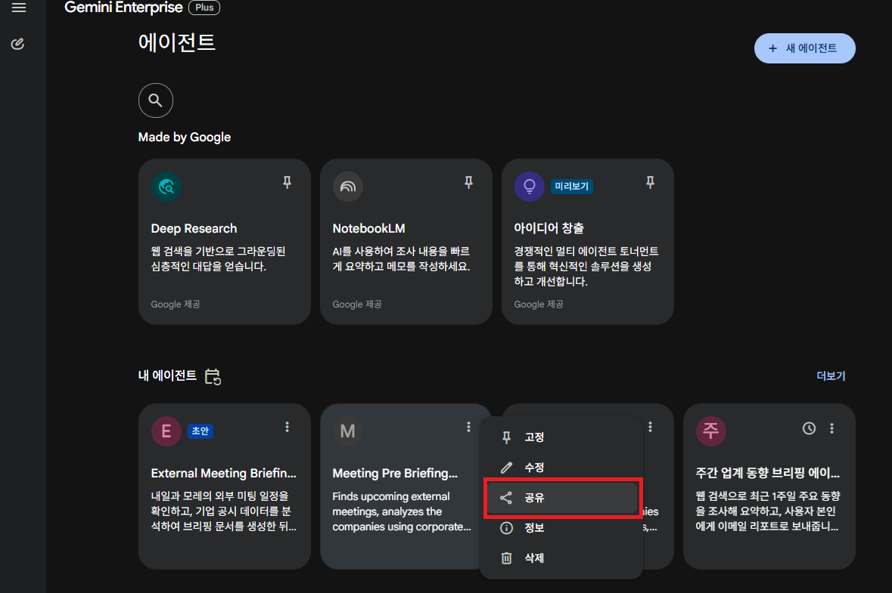

*▲ 우측 상단 '공유' 버튼으로 링크를 만들면, 동료가 같은 에이전트를 바로 쓸 수 있습니다.*

> **느낀 점 한 줄** — *"IT 지식이 없어도 우리 팀 전용 AI 동료(에이전트)를 배포했다."* 게다가 누가 무엇을 만들었는지, 어떤 커넥터를 쓰는지 모두 **관리자 콘솔에서 관리**됩니다. 

---

## 4. 정리 

### 오늘의 핵심 3줄

1. Gemini Enterprise는 회사 데이터·도구에 연결돼 **실제 일을 하는 'AI 동료'** — 검색 답변이 아니라 *실행 결과*를 줍니다.
2. **문서에 적힌 건 사내 지식(출처 자동), 실시간 값은 전용 도구(Custom MCP 서버, 예: SEC 공시·DART)** — 알맞게 골라 쓰면 누가 써도 같은 품질. 필요한 시스템은 Custom MCP 서버로 계속 연동할 수 있어요.
3. 진짜 가치는 **업무에 활용하여 생산성을 높이는 것** — 한 명이 만든 에이전트를 **팀 전체가 같은 품질로** 사용 가능합니다.

---
## 5. 설문조사 

### <a class="moaform-embed moaform-style-button" href="https://moaform.com/q/y2fhBw?embed" data-type="popup" target="_blank"> 📚 설문하기(클릭) - 향후 개선을 위해 짧은 시간내어 소중한 의견 부탁드립니다.</a>
<script>(function() { var s, b; s = document.createElement('script'); s.src = '//asset.moaform.com/embed/e.js'; b = document.getElementsByTagName('body')[0]; b.insertBefore(s, b.firstChild); })()</script>

*막히면 채팅창에서 진행 보조에게 요청하세요. 모든 프롬프트는 그대로 복사해 사용하시면 됩니다.*
